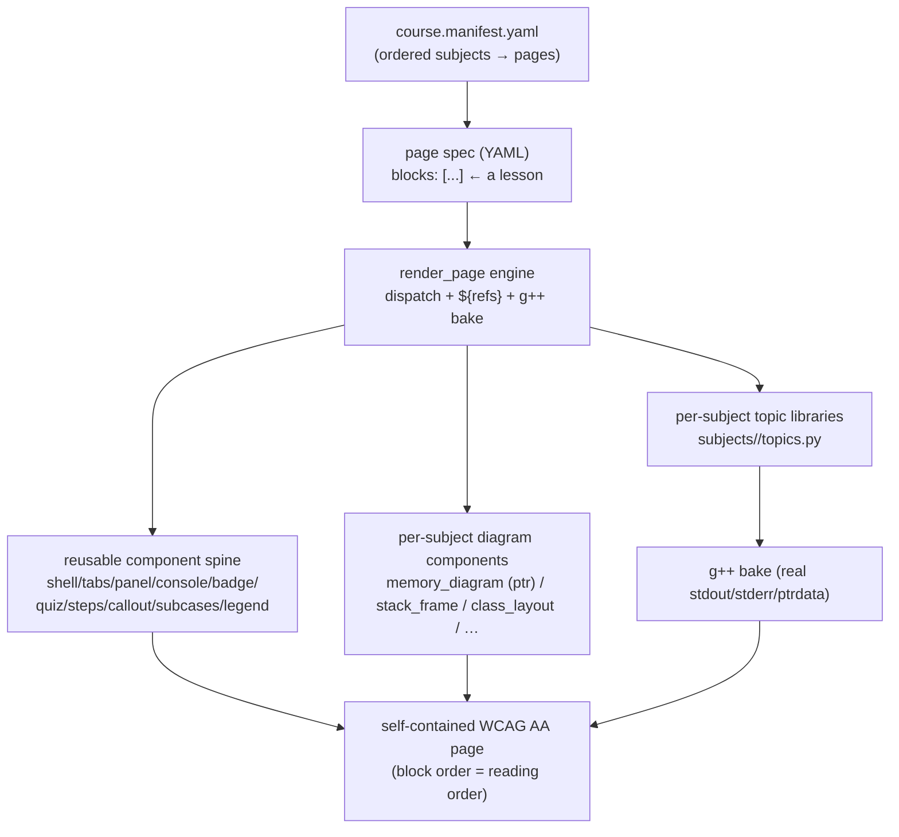

# Building a C++ Course from Topic Libraries

A design note on scaling the pointer lab's machinery into a full C++ curriculum —
one **topic library per subject**, composed into lessons by YAML, ordered into a
course by a manifest. Captures the architecture discussion of 2026-06-30.

> Status: design / direction. Not yet implemented beyond the pointer subject.
> Load-bearing code referenced by path; this file does not restate it.

---

## 1. The core reframe: content and curriculum are different layers

A recurring confusion is to ask "should I reuse my 15 topics, or expand to 30–50,
or group them per subject?" — as if these were one decision. They are not. There
are **two independent layers**:

- **Content** — a `TopicTemplate`: a real C++ program (with variants), its
  instrumentation, and its explanation. It bakes to real `g++` output and a
  diagram. *This is what you author per subject.*
- **Curriculum** — the order and framing of content into lessons and a course.
  *This is text and sequence, expressed as YAML, and is free to change.*

The consequence, stated bluntly:

> You **cannot** build a Classes lesson by re-texting pointer topics. The 15
> pointer topics are pointer *programs*; reordering and rewording them produces
> different *pointer* lessons, never a ctor/cctor/move lesson. New subjects need
> **new topic templates** — new programs, new instrumentation, new diagrams.

So the answer to "reuse vs expand vs per-subject" is: **reuse at the curriculum
layer, author new content per subject, and organize that content per subject.**
You need all three; they operate at different layers.

---

## 2. The four-layer architecture



| Layer | What it is | Where it lives | Editable by |
|---|---|---|---|
| **Course manifest** | Ordered list of subjects → pages; drives top-level nav | `course.manifest.yaml` | instructor |
| **Page spec** | One lesson: a flat `blocks:` list of components | `pages/<lesson>.page.yaml` | instructor |
| **Topic library** | ~10–15 `TopicTemplate`s for one subject | `subjects/<area>/topics.py` | dev |
| **Components** | Pure render functions (spine + diagrams) | `components.py`, `diagrams/*.py` | dev |

Already built (pointer subject): the component library
(`cpp_ptr_lab/components.py`), the YAML page engine
(`cpp_ptr_lab/yaml_engine/render_page.py`), and a worked page spec
(`cpp_ptr_lab/basic_ptr/basic_ptr.page.yaml`). The manifest layer and the
non-pointer subjects are future work.

---

## 3. Decision: per-subject libraries (not a flat pile)

Organize content as **one topic module per subject**, ~10–15 topics each — not a
flat 30–50 in a single namespace.

```
subjects/
  initializers/topics.py      # ~8 topics
  pointers/topics.py          # existing 7  (today: pointers_refs/topics.py)
  smart_ptrs/topics.py        # existing 8
  stack_frames/topics.py      # recursion / non-recursion / heap vs stack
  classes/topics.py           # ctor / cctor / assign / move; return & arg types
  function_args/topics.py     # by value / pointer / reference
  templates/topics.py         # single / multiple / specialized
  stl/topics.py               # explore via discussion
```

**Why per-subject, not flat:** cohesion; independent on/off via
`lab_config.yaml`; matches the `pointers_refs` / `smart_ptrs` split already
validated in this repo; each subject is editable in isolation. A flat 50-topic
namespace gives none of that. The topic registry simply aggregates every
subject module by id (it already does this for two modules — add imports).

**Author topics lazily.** Do not pre-create 50 topics speculatively. Author a
subject's topics when you build that subject's lesson, driven by the gotchas and
variants actually worth showing. Each subject also needs its **own
instrumentation** — the pointer `PTRDATA:` / `MEMBYTES:` printf convention is
pointer-specific; classes would print which special member fired, templates would
surface instantiation errors, stack frames would print frame addresses/depth.

---

## 4. The load-bearing insight: reusable spine vs. subject-specific diagrams

Of the 15 components built for pointers, two kinds — and this is what makes new
subjects cheap:

| Reusable across **every** subject (the spine, ~10) | Pointer-specific (won't transfer, ~4) |
|---|---|
| `page_shell`, `variant_tabs`, `code_diagram_panel`, `output_console`, `compile_status_badge`, `predict_reveal_quiz`, `progressive_steps`, `callout_note`, `stacked_subcases`, `color_legend` | `memory_diagram`, `byte_grid`, `hover_link_diagram`, `before_after_toggle` (of pointer states) |

Therefore:

> **A new subject = 1 new topic module + 1–3 new *diagram* components + YAML pages.**

~⅔ of the per-page work (prose, tabs, console, badge, quiz, steps, layout) is
already done for any subject. Only the *diagram vocabulary* is new: stack frames
want a frame-stack diagram, classes want a special-member call-trace, templates
want an instantiation/error tree. Keep diagrams in a `diagrams/` package, one
module per subject, so the spine stays subject-agnostic.

---

## 5. Why the YAML page model is inherently ADA-friendly

The page engine renders a **flat `blocks:` list**, and:

> **block order = DOM order = screen-reader reading order.**

That single property gives WCAG **1.3.2 Meaningful Sequence** *by construction* —
there are no absolutely-positioned columns or CSS reorderings to audit. Reorder
the blocks and you have reordered exactly what a screen reader announces.

"Top-down layout" is therefore not a literal ADA mandate, but it is the **cheapest
path to AA**, and the YAML model gives it for free. Supporting points already in
place:

- **Reflow (1.4.10):** the one two-column component (`code_diagram_panel`)
  collapses to a single column at 760px; even then code-before-diagram source
  order is preserved.
- **Headings (1.3.1 / 2.4.6):** lessons use a proper `h1 → h2 → h3` structure.
- **Self-contained, zero-JS, zero-network:** survives Canvas; no script/`fetch`
  to break accessibility or embedding.

---

## 6. The YAML lesson model (already implemented for pointers)

A lesson is a flat list of blocks; each block is `{component_or_builder: {args}}`.
The engine pops `id`, forwards the rest as keyword args to the matching component,
and resolves `${a.b.c}` references against data baked from the `bake:` topics.

```yaml
title: "Basic Pointer"
bake: { bp: basic_ptr }          # compile this topic; expose variants as ${bp.*}
blocks:
  - callout_note: { id: intro, label: Concept, text: "${bp.explanation}" }
  - topic:        { id: types, source: bp }        # variant_tabs cluster over bp
  - progressive_steps: { id: steps, steps: [ {summary: ..., content: ...}, ... ] }
  - predict_reveal_quiz:
      id: quiz
      options: ["the address of val", "${bp.int.target_val}", "0"]
      correct_index: 1
```

Two properties matter for a course:

- **YAML key names ARE the component parameters** — no hidden mapping; the dispatch
  table is the documentation of legal keys.
- **The same template can appear any number of times on a page**, each instance
  namespaced by its per-block `id` (proven by tests). This is what lets a lesson
  on, say, function arguments show the *same* pointer template twice with different
  inputs without id collision.

A "smart" builder `topic` composes the per-variant cluster (code + diagram +
badge + console + bytes); `heading` / `html` provide chrome. New subjects will add
their own smart builders as needed (e.g. a `call_trace` builder for classes).

---

## 7. Known gaps before this generalizes cleanly

Both are isolated to `_build_topic` / `_bake_one` in `render_page.py` — the engine
itself (dispatch, ref resolution, render loop) is already topic-agnostic:

1. **Multi-sub-case topics are unhandled.** Only `const_taxonomy` uses
   `TopicTemplate.cases`; `_bake_one` flattens it away. Fix: keep `v["cases"]`,
   branch `_build_topic` to emit the existing `stacked_subcases` component.
2. **The `topic` layout is a fixed recipe.** Make it configurable
   (`topic: { show: [code, diagram, status, output, bytes] }` or an explicit
   `panel:` block-template) so subjects can vary the per-variant layout.
3. **Raw-pointer assumptions in convenience data** (`${X.target_val}`, the
   byte-grid caption) degrade to `"?"` for smart/ref topics; make per-type or drop.

---

## 8. Recommended first move

Prove the "new subject" path **cheaply** before a diagram-heavy subject. Build
**`function_args`** (by value / pointer / reference): it reuses `memory_diagram`
(still pointer/reference semantics), so it needs a new topic module + a YAML page
and **zero new diagram components**. That validates the end-to-end flow —
subject module → bake → YAML page → self-contained AA page — and exercises the
engine generalizations from §7. Then tackle a diagram-heavy subject (stack frames
or classes), where the new cost is the diagram component(s), not the plumbing.

---

## 8a. Authoring workflow: how to start a new subject

Two naive paths exist — **page-first** (mock the HTML, derive topics from it) and
**topic-first** (decide the topics, then compose pages). They are not competitors:
page-first is the *spec*, topic-first is the *build*. Each pure path has a failure
mode — page-first tempts you to hand-author the final HTML (defeats generation;
not baked, not reproducible), and topic-first risks *topics in search of a lesson*
(content no page composes).

**Resolve it with the engine's pure render path.** Because `render_page(spec, data)`
is pure (the tests feed it a hand-written `FAKE` data dict, no g++), the prototype
*is a YAML page spec with fake data* — page-first discovery, in the real
deliverable format, with **zero throwaway**:

1. Write `<subject>.page.yaml` + a fake data dict → open the rendered page. This
   forces you to name, in the target format, the topics, the interactions, and —
   crucially — **whether you need a new component** (you feel the gap when no block
   expresses what you want).
2. Then go topic-first: author the `TopicTemplate`s it named (TDD, real g++ bake),
   add any new diagram component, and swap fake data for a real `bake:`. The
   prototype becomes the production page by filling in, not rewriting.

**Which to lead with depends on novelty** — specifically, whether the subject needs
new *diagram/interaction* components (the expensive, hard-to-guess part):

| Subject | New components? | Lead with |
|---|---|---|
| `function_args` (value/ptr/ref) | none — reuses `memory_diagram` + `before_after_toggle` | topic-first (skip the prototype) |
| `templates` (single/multiple/specialized) | probably few — `variant_tabs` over types + `code_diagram_panel` + failing-compile `output_console` | fake-data prototype first (confirm the gap) |
| `stack_frames`, `classes` | yes — frame-stack diagram, special-member call-trace | fake-data prototype first (discover the diagram) |

Rule: **known territory → topic-first; novel/diagram-heavy → fake-data prototype
first, then topic-first.** The prototype earns its keep exactly when you cannot yet
picture the diagram.

## 8b. Prior-art research as the idea source

A third input sits **upstream of both paths**: survey what others have built, keep
what fits, and derive topics beyond the base. The pipeline is **research →
prototype (fake-data YAML) → topics**.

**The filter that makes this productive — steal the pedagogy and the diagram
vocabulary, not the runtime.** Almost every great C++ teaching tool is dynamic (JS,
a backend, live stepping); our constraint is static / zero-JS / baked / Canvas. So
every borrowed idea passes two gates: (1) **pedagogical fit** for grad students weak
in C, and (2) **static-expressibility** — can it render as *baked snapshots switched
by CSS* (`progressive_steps`, `before_after_toggle`, `predict_reveal_quiz`,
`variant_tabs`)? A *live* execution stepper (Python Tutor) becomes, for us, a *baked
execution trace*: a fixed sequence of snapshots revealed by `<details>`/radio. The
pedagogy survives; the runtime does not transfer. Without this filter, prior art is
a buffet and you build everything.

Anchor tools (to verify with a real scan), mapped to subjects:

| Prior art | What it does | What we derive (filtered) |
|---|---|---|
| **C++ Insights** (cppinsights.io) | shows compiler-*generated* code: implicit ctor/cctor/move/assign, template instantiation | **classes**, **templates** — "reveal what the compiler generates"; static text → directly bakeable; ~no new components. **Highest leverage.** |
| **Python Tutor** (Guo) | live stack+heap with arrows, stepped | **stack frames**, **pointers/refs** — baked frame diagram + stepped trace; the one genuinely new component (frame diagram) |
| **Compiler Explorer** (godbolt) | source → asm + multi-compiler diagnostics | **templates** — instantiated source + real error for bad types; mostly existing components |
| **Effective C++ / Modern C++** (Meyers), cppreference notes | catalog of gotchas/items | **gotcha topics across all subjects** — direct fuel for `predict_reveal_quiz` + failing-compile topics |
| **learncpp.com / C++ Primer** (Lippman) | structured tutorial taxonomy | the **course manifest** order + per-subject topic lists |

Hard rule: *an idea earns a topic only if it has a learning objective AND a baked,
color-redundant, AA-compliant rendering.* A real research pass (scoring current
tools against the two gates, producing a "tool → interaction → component → topic"
mapping) is queued as a next step — see the session handoff.

## 9. Summary of decisions

1. **Decouple content from curriculum.** Curriculum = YAML order/text (free);
   content = per-subject topic templates (authored).
2. **Content → per-subject libraries** of ~10–15 topics; aggregate by registry;
   author lazily, with subject-specific instrumentation.
3. **Reuse the ~10-component spine; budget 1–3 new diagram components per subject.**
4. **Curriculum → YAML page specs + a course manifest;** flat block order is the
   ADA mechanism (meaningful sequence by construction).
5. **The 15 pointer topics recompose only into pointer lessons** — they do not seed
   other subjects.
6. **First proof: `function_args`** (no new diagram components), then generalize
   the engine (cases + configurable layout) and move to diagram-heavy subjects.

### Related artifacts
- `cpp_ptr_lab/components.py` — the component library (the spine + pointer diagrams).
- `cpp_ptr_lab/yaml_engine/render_page.py` — the YAML lesson engine.
- `cpp_ptr_lab/basic_ptr/basic_ptr.page.yaml` — a worked lesson spec.
- `cpp_ptr_lab/topic_page.py` — the imperative equivalent (parity reference).
- `cpp_ptr_lab/lab_config.yaml` — per-lab/topic visibility (the "hide topics" knob).
- `handoffs/HANDOFF_2026-06-30_18h32mEST.md` — session handoff with next steps.
