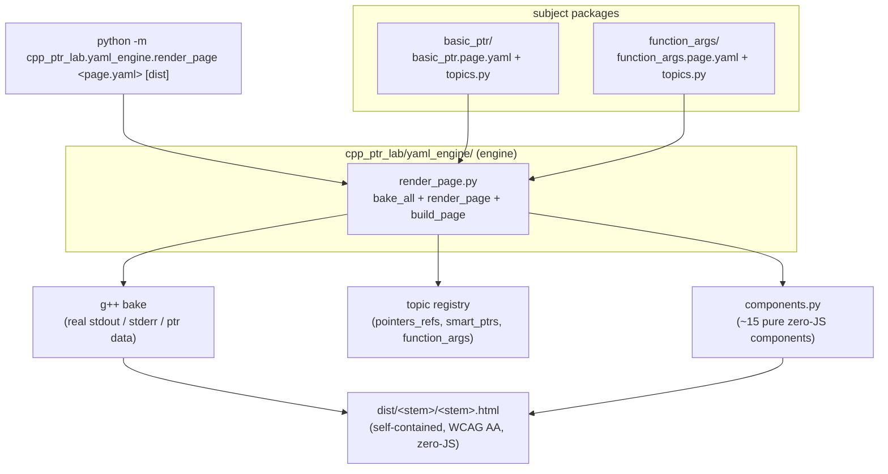

# C++ Interactive Labs

Build-time generator that turns C++ teaching "topics" (pointers, references,
function-argument passing, `const` semantics) into **standalone, static HTML
lessons** for a graduate C++ course (ISC5305). Each page bakes in **real `g++`
compiler output** and renders accessible, zero-JavaScript memory diagrams — so a
lesson is a single self-contained file you can paste straight into an LMS.

Repo: <https://github.com/erlebach/C-interactive-labs>

---

## What it is / Why

Graduate students taking a scientific-computing C++ course are often weak in C,
and the concepts that trip them up most — pointer vs. reference, pass-by-value
vs. pass-by-pointer, when `const` forbids a write — are exactly the ones that
benefit from *seeing the memory and the real compiler verdict*.

An earlier version of this lab was an interactive [DearPyGui](https://github.com/hoffstadt/DearPyGui)
desktop app. It was migrated to **static HTML** for two reasons:

1. **Accessibility (WCAG AA / ADA).** The desktop UI could not meet
   screen-reader / keyboard / contrast requirements. Static HTML with native
   controls can.
2. **The Canvas constraint.** The target LMS (Canvas) strips `<script>` and
   blocks network requests from pasted content. A lesson therefore has to work
   with **zero JavaScript and zero network access** — it must be a single inert
   HTML document.

The generator resolves both: it does all the "dynamic" work (compiling, running,
capturing output, drawing diagrams) **at build time** on your machine, and emits
a frozen, self-contained page a student's browser only has to *display*.

---

## Features

- **Static, zero-JS, zero-network output.** Generated pages contain no
  `<script>`, no `fetch`, no external `src`/`href` to assets — they survive being
  pasted into Canvas and work fully offline.
- **Real `g++` output baked in.** At build time each variant is compiled and run;
  its stdout/stderr is captured and embedded — including *authentic compiler
  errors* for "gotcha" topics (e.g. writing through a `const` pointer, rebinding a
  reference). The build fails early if `g++` is not on `PATH`.
- **WCAG AA / accessible by construction.**
  - Variant switching uses native radio inputs plus a CSS `:checked` sibling
    selector — keyboard- and screen-reader-navigable with **no JavaScript**.
  - Memory diagrams are inline SVG with `<title>`, `<desc>`, and `role="img"`.
  - High-contrast light theme; a single semantic color palette (`--c-addr`,
    `--c-val`, `--c-type`, `--c-const`, `--c-err`) vetted to ≥ 4.5:1 on white,
    with color always redundant with text/border/icon.
  - Flat page structure means **DOM order = screen-reader reading order**
    (WCAG 1.3.2 Meaningful Sequence for free); the one two-column panel reflows
    to a single column at narrow widths.
- **YAML-driven, subject-agnostic engine.** A lesson is a flat list of blocks in a
  `<subject>.page.yaml`; the engine dispatches each block to a pure render
  component and bakes topic data referenced by `${...}`.
- **Reusable component spine.** ~15 pure, zero-JS page components (tabs, panels,
  compile badges, output consoles, byte grids, quizzes, progressive-reveal steps,
  memory diagrams, stacked sub-cases, …).
- **TDD throughout.** The suite is ~344 tests; g++-dependent tests are gated and
  the build refuses to produce fake compiler output.

---

## Requirements

- **Python 3** (run as a package via `python -m ...`; no `setup.py`/`pyproject.toml`
  — there is nothing to install beyond the dependencies below).
- **A C++ compiler on `PATH` as `g++`.** Required at build time; pages bake real
  compiler output and the builder exits with an error if `g++` is missing.
- **Python packages** (`requirements.txt`):
  - `pyyaml` — parses the page specs (this is what the static-HTML pipeline needs).
  - `dearpygui>=2.0.0` — a **legacy** dependency from the original interactive
    desktop app; not needed to build the static HTML lessons.

```bash
pip install -r requirements.txt
```

> Generated pages themselves have **no runtime dependencies** — they are plain HTML.

---

## Quick start

Run everything **from the project root** (the `-m` module path and the relative
`dist/` output path resolve against the current directory).

```bash
pip install -r requirements.txt

# Build a lesson page from its YAML spec:
python -m cpp_ptr_lab.yaml_engine.render_page cpp_ptr_lab/basic_ptr/basic_ptr.page.yaml
# -> writes dist/basic_ptr/basic_ptr.html

python -m cpp_ptr_lab.yaml_engine.render_page cpp_ptr_lab/function_args/function_args.page.yaml
# -> writes dist/function_args/function_args.html
```

Usage: `python -m cpp_ptr_lab.yaml_engine.render_page <page.yaml> [dist_dir]`.
The optional second argument overrides the output directory (default: `./dist`);
output lands in `dist/<spec-stem>/<spec-stem>.html`. Open that file in a browser,
or paste its contents into Canvas.

---

## Architecture

Content and curriculum are treated as **independent layers**: a *topic* is a real
C++ program (with variants, instrumentation, and an explanation) that bakes to
compiler output and a diagram; a *lesson* is just the order and framing of topics,
expressed as YAML. This yields a four-layer model (see
[`COURSE_VIA_TOPICS.md`](COURSE_VIA_TOPICS.md) for the full design note):

| Layer | What it is | Where it lives |
|---|---|---|
| **Course manifest** | ordered subjects → pages (planned, not yet built) | `course.manifest.yaml` (future) |
| **Page spec** | one lesson: a flat `blocks:` list | `cpp_ptr_lab/<subject>/<subject>.page.yaml` |
| **Topic library** | ~10–15 `TopicTemplate`s per subject | `cpp_ptr_lab/<subject>/topics.py` (and `pointers_refs/`, `smart_ptrs/`) |
| **Components** | pure zero-JS render functions (spine + diagrams) | `cpp_ptr_lab/components.py` |

The **engine** (`yaml_engine/render_page.py`) is subject-agnostic: it reads a page
spec, pops each block's `id`, forwards the rest as keyword args to the matching
component, resolves `${a.b.c}` refs against baked data, and (for `build_page`)
first compiles/runs the referenced topics with `g++`. A **subject package** is
just data + content: a `topics.py` and a `<subject>.page.yaml`. Every subject
folder has the identical shape `{__init__.py, topics.py, <subject>.page.yaml,
test_<subject>.py}`.



Because `render_page(spec, data)` is a **pure** function (the tests feed it a
hand-written fake data dict, no `g++`), you can prototype a lesson with fake data
in the real deliverable format before authoring the actual topics.

---

## Project layout

```
opencode/
├── cpp_ptr_lab/                     # main package (the C++ pointer lab)
│   ├── yaml_engine/
│   │   ├── render_page.py           # subject-agnostic YAML → HTML engine (the CLI)
│   │   └── test_render_page.py      # pure-render tests
│   ├── basic_ptr/                   # subject: pointer basics
│   │   ├── basic_ptr.page.yaml      # lesson spec (flat blocks list)
│   │   ├── topics.py                # re-exports basic_ptr topic from pointers_refs
│   │   └── test_basic_ptr.py        # build test
│   ├── function_args/               # subject: value / pointer / reference passing
│   │   ├── function_args.page.yaml
│   │   ├── topics.py
│   │   └── test_function_args.py
│   ├── pointers_refs/topics.py      # pointer/reference topic templates (incl. const_taxonomy)
│   ├── smart_ptrs/topics.py         # unique/shared/weak_ptr topic templates
│   ├── components.py                # ~15 pure zero-JS accessible components
│   ├── code_generator.py            # builds the C++ source for each variant (TopicTemplate, CaseDef)
│   ├── compiler_runner.py           # compile + run + capture stdout/stderr
│   ├── html_renderer.py             # theme + semantic color palette + fragment rendering
│   ├── topic_page.py                # imperative equivalent of the YAML page (parity reference)
│   ├── gallery.py                   # builds a demo page per component → dist/gallery/
│   ├── lab_config.yaml              # per-lab / per-topic visibility knob
│   ├── app_base.py                  # legacy DearPyGui app (pre-migration)
│   └── tests/                       # shared unit/integration tests
├── cpp_initializer_lab/             # a second (initializers) lab package
├── dist/                            # generated HTML output (build artifacts)
├── openspec/                        # OpenSpec specs & change proposals
├── handoffs/                        # session handoff notes
├── prototype/                       # throwaway prototype (basic_ptr.html)
├── COURSE_VIA_TOPICS.md             # 4-layer curriculum architecture design note
├── JOURNAL.md                       # chronological log of features & decisions
└── requirements.txt
```

---

## Testing

Run the suite from the project root:

```bash
python -m pytest cpp_ptr_lab/
```

As of the latest session the suite is **344 passing**. Tests that need a real
compiler are gated on `g++` being available; the build itself refuses to emit
fabricated compiler output.

---

## Status / roadmap

Two subjects are built end-to-end (`basic_ptr`, `function_args`) plus the pointer
and smart-pointer topic libraries. Honest current gaps and next steps (from the
latest handoff and [`COURSE_VIA_TOPICS.md`](COURSE_VIA_TOPICS.md)):

- **Engine gap 1 — multi-sub-case topics.** `const_taxonomy` (the `const` 2×2
  truth table) uses `TopicTemplate.cases`; the YAML engine currently flattens
  those away instead of rendering them via the `stacked_subcases` component.
- **Engine gap 2 — configurable `topic` layout.** The per-variant panel is a
  fixed recipe; make the shown sub-parts selectable per subject.
- **Course manifest.** A `course.manifest.yaml` for ordered, multi-subject
  navigation is designed but not yet implemented (now unblocked with ≥ 2
  subjects).
- **More subjects.** Planned per the curriculum: initializers, stack frames,
  classes (ctor/cctor/assign/move), templates, STL — each adds a topic module and,
  where needed, 1–3 new diagram components.

Development follows **TDD** (RED before GREEN) and uses **OpenSpec** to track
capabilities and changes (`openspec/specs/`, `openspec/changes/`).

---

## License

Not yet specified — there is no `LICENSE` file in the repository at this time.

---

*Course context: my objective for ISC5305 is to teach students to use OpenCode
critically with the help of open-source models; these labs are part of that
effort.*
