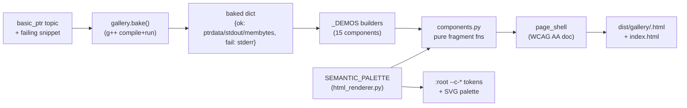

# HANDOFF — 2026-06-30 14h49mEST

**Focus for the next session:** The `interactive-ptr-components` OpenSpec change is fully
implemented and the user has confirmed all 15 gallery pages work as expected — run
`/opsx:verify` then `/opsx:archive` to close it out. (Re-verify because a correctness fix
landed *after* the original completion.)

## Read first / references
- **`handoffs/HANDOFF_2026-06-29_22h19mEST.md`** — prior handoff; the `cases` multi-sub-case
  work that preceded this change. Superseded as the active task by this change.
- **`openspec/changes/interactive-ptr-components/`** — proposal, design, specs (3 capability
  deltas), tasks.md (all 48 marked `[x]`). The contract the implementation satisfies.
- **`cpp_ptr_lab/components.py`** — the 15-component library (the deliverable).
- **`cpp_ptr_lab/gallery.py`** — gallery build target (`python -m cpp_ptr_lab.gallery`).
- **`cpp_ptr_lab/html_renderer.py`** — `SEMANTIC_PALETTE` + `:root` token injection (top of
  file) and the unchanged `svg_renderer`/`render_fragment`/`assemble_page` it builds on.
- **JOURNAL.md** — entries `2026-06-30 14:00` (build) and `2026-06-30 14:49` (the fix).

## What changed this session
- **Implemented `interactive-ptr-components` (48/48 tasks), TDD throughout.** New pure module
  `cpp_ptr_lab/components.py` (15 components), new `cpp_ptr_lab/gallery.py`, new tests
  `tests/test_components.py` + `tests/test_gallery.py`. Semantic palette added to
  `html_renderer.py`. Additive only — the existing 130 tests were untouched.
- **Fixed a real `code_line_link` bug found while explaining it.** The hover/focus highlight
  used the `~` sibling combinator, but the linked `<code>` line was trapped inside a `<pre>`,
  so it was never a sibling of `.cll-diagram` and the rule never matched. Fix: emit lines as
  direct children of `#{comp_id}` (no `<pre>`), styled as a contiguous code block. Added
  `TestCodeLineLink::test_linked_line_and_diagram_share_a_parent` — it **parses** the fragment
  (html.parser) and asserts line and diagram share the namespaced parent, catching what
  string-matching tests structurally cannot.
- **Verification:** full suite **313 passed** via `python -m pytest cpp_ptr_lab/tests/`;
  gallery rebuilt → 16 self-contained pages in `dist/gallery/` (0 external/script/network
  refs); all 5 color tokens ≥4.5:1 on white (amber tightest, 4.87:1); user confirmed all 15
  pages render/behave correctly.
- **Commit `5cb9e48`** captured only JOURNAL.md (Stop-hook). The new modules + the fix are
  committed by the `/git` run that produced this handoff — see latest `git log`.

## Decisions locked
- **Zero-JS, CSS-only interactivity** (`:checked`/`:hover`/`:focus`/`
`) — survives
  Canvas's `<script>`/`fetch` stripping; rules out any progressive-enhancement JS baseline.
- **One semantic palette, single source** — `SEMANTIC_PALETTE` in `html_renderer.py` feeds
  both the `:root` `--c-*` tokens (via `/*SEMANTIC_TOKENS*/` injection) and the SVG palette;
  do not reintroduce raw per-component hex.
- **Components are pure, id-namespaced functions** — `(comp_id, data…) -> str`, every
  id/name/for sanitised to `[A-Za-z0-9_-]`. No I/O. Enforced by parametrized invariant tests.
- **Sibling combinators require real siblings** — any CSS that links two regions with `~`
  must keep both regions direct children of the namespaced container (the `code_line_link`
  lesson); prefer a parse-based test over string matching for such links.
- **Gallery bakes real g++ output and fails early without g++** — output is build-time, not
  view-time.

## Next steps
1. **`/opsx:verify` the change**, then **`/opsx:archive`** — gated on the verify passing.
   The change is feature-complete and user-confirmed; this is the only remaining action.
2. *(Optional polish)* `code_diagram_panel`'s gallery demo passes a placeholder
   `<svg>diagram</svg>` — wire it to a real baked `memory_diagram` (like the other demos) so
   its reflow is shown with real content. Cosmetic; not required to archive.
3. *(Future, per design Non-Goals)* Assemble real topic pages from this catalog and port the
   remaining TODO.md topics — a separate change, not part of this one.

## Constraints still in force
- **Build-time only; the user runs/serves the output.** Don't add a backend or runtime
  compilation. Static, self-contained, Canvas-pasteable is the hard requirement.
- **TDD mandatory** (RED before GREEN, per `~/.claude/memory/feedback/testing.md`) — overrides
  OpenSpec's tests-last ordering.
- **Additive / surgical diffs** — do not disturb the existing renderer or the 130 prior tests.
- **Generated `.md` files need a `YYYY-MM-DD_HHhMMmEST` stamp** (this file complies).
- **g++ required** for the gallery build and the compiler-backed tests.

## Suggested skills
- **opsx:verify** — validate implementation against the change artifacts before archiving.
- **opsx:archive** — finalize the change once verify passes.
- **karpathy-coding** — for the optional `code_diagram_panel` demo polish (surgical edit).
- **mgrep** — semantic search over `cpp_ptr_lab/` + JOURNAL.md if orienting from cold.

## State-of-the-system diagram — gallery build pipeline (new this session)

