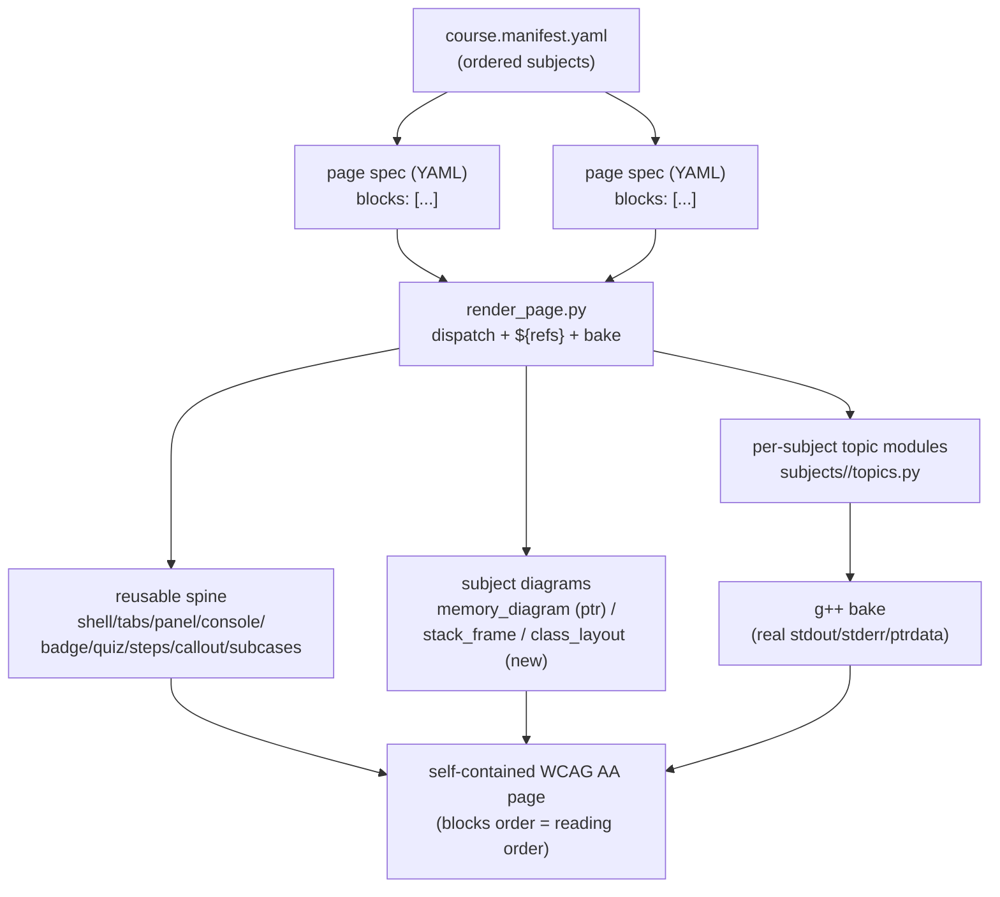
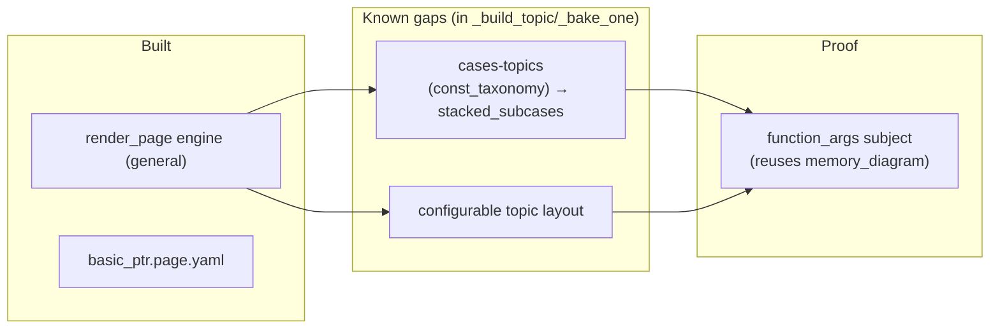

# HANDOFF — 2026-06-30 18h32mEST

**Focus for the next session:** Prototype **`function_args`** (value / pointer / reference) as the
end-to-end "new subject" proof — a `subjects/function_args/topics.py` + a `function_args.page.yaml`
rendered through the YAML engine, reusing `memory_diagram` so it needs **zero new diagram
components**. In passing, close the two known engine gaps (cases-topics + configurable `topic`
layout). All TDD.

## Read first / references
- **`handoffs/HANDOFF_2026-06-30_14h49mEST.md`** — prior handoff (component library + gallery state).
- **`cpp_ptr_lab/basic_ptr_yaml/render_page.py`** — the YAML→HTML translator built this session.
  Read its module docstring for the block/dispatch/ref model. **This is the load-bearing artifact.**
- **`cpp_ptr_lab/basic_ptr_yaml/basic_ptr.page.yaml`** — the worked page spec (data, not Python).
- **`cpp_ptr_lab/topic_page.py`** — the *imperative* equivalent the YAML reproduces; the parity
  reference. Deletable once you're confident in the YAML path.
- **`cpp_ptr_lab/components.py`** — the 15-component library the engine dispatches to.
- **`cpp_ptr_lab/lab_config.yaml`** — existing per-lab/topic visibility config (the "hide topics" knob).
- **JOURNAL.md** entry `2026-06-30 18:30` — this session's summary.

## What changed this session
- **New subpackage `cpp_ptr_lab/basic_ptr_yaml/`** — a YAML-driven page renderer (commit pending in
  the `/git` that produced this handoff). A page is a flat `blocks:` list; each block is
  `{component_or_builder: {args}}`; the translator pops `id`, forwards the rest as kwargs to the
  matching `components.py` function, and resolves `${a.b.c}` refs from baked data. Two smart builders
  compose multiple components: `topic` (a `variant_tabs` cluster over a baked topic), `heading`/`html`
  (chrome). Files: `render_page.py`, `basic_ptr.page.yaml`, `test_render_page.py`, `__init__.py`.
- **Verification:** YAML page is component-signature-identical to `dist/topics_v2/basic_ptr.html`
  (legend×1, badge×3, byte-grid×3, vt-tabs×7, qfb×4, details×3, callout×1, role=img×3, PTRDATA×6),
  self-contained, no dup ids. Suite **333 passed** (`python -m pytest cpp_ptr_lab/`). Output at
  `dist/basic_ptr_yaml/basic_ptr.html`.
- **Generality analysis (no code change):** the *engine* (dispatch, ref resolution, bake, render loop)
  is topic-agnostic and the registry already bakes 15 topics. Two real gaps, both isolated to
  `_build_topic` + `_bake_one` (see Next steps 1–2).

## Decisions locked
- **Page = flat YAML `blocks:` list; engine translates 1:1 to component calls.** YAML key names ARE the
  component parameter names (no hidden mapping). Same component any number of times — namespaced by
  per-block `id`. Proven by two passing "twice on a page" tests.
- **Flat block order = DOM order = screen-reader reading order.** This is *why* the model is ADA-friendly
  (WCAG 1.3.2 Meaningful Sequence satisfied by construction; reorder blocks = reorder reading order, no
  CSS-reorder audit). "Top-down" is the cheapest path to AA, not a literal mandate.
- **Curriculum architecture (4 layers):** course manifest (order) → page specs (lessons) → per-subject
  topic modules → components. Content organized **per-subject (10–15 topics each)**, NOT a flat 30–50.
  Mirrors the existing `pointers_refs` / `smart_ptrs` split.
- **Reusable spine vs subject-specific diagrams:** ~10 of 15 components (shell, tabs, panel, console,
  badge, quiz, steps, callout, subcases, legend) transfer to ANY subject; the 4 diagram components
  (`memory_diagram`, `byte_grid`, `hover_link_diagram`, `before_after_toggle`) are pointer-specific.
  New subject = new topic module + 1–3 new diagram components + YAML pages. Author topics **lazily**
  per lesson, not 50 up front.
- **The 15 pointer topics recompose only into *pointer* lessons** (text/order = free). They do NOT seed
  classes/templates/STL — those need new programs + instrumentation.

## Next steps
1. **Wire cases-topics through the engine.** Only `const_taxonomy` uses `TopicTemplate.cases`;
   `_bake_one` currently flattens it to `source=''`, `ptrdata=None` (verified). Keep `v["cases"]` in
   `_bake_one`; branch `_build_topic` (or add `topic: { layout: subcases }`) to emit the existing
   `stacked_subcases` component. ~25 lines + RED tests. This proves the engine handles the gotcha class.
2. **Make `topic` layout configurable** — e.g. `topic: { show: [code, diagram, status, output, bytes] }`
   or an explicit `panel:` block-template, instead of the one hardcoded recipe in `_build_topic`.
3. **Prototype `function_args`** (the Focus) — smallest new subject; reuses `memory_diagram`, zero new
   diagram components. Validates the new-subject path end-to-end before a diagram-heavy subject
   (stack frames, classes).
4. **Course manifest** (`course.manifest.yaml` → ordered subject nav) once ≥2 subjects exist.
5. *(Optional)* delete `topic_page.py` once the YAML path is trusted.
6. **Raw-pointer assumptions:** `${X.target_val}` and the byte-grid caption assume raw semantics;
   degrade to `"?"` for smart/ref topics. Make per-type or drop the shortcut.

**Blocked/gated — git remote diverged:** local `main` is ahead of `origin/main` AND the remote has
commits not local (non-fast-forward on push, and the auto-classifier also blocks direct pushes to
`main`). Nothing is pushed since `5cb9e48`'s parent. Resolve with `git fetch` + inspect
(`git log --left-right main...origin/main`) before any pull/rebase or `--force-with-lease`. The user
decides; do not force-push unprompted.

## Constraints still in force
- **Static, zero-JS, zero-network, Canvas-pasteable** output. No backend/runtime compilation.
- **TDD mandatory** (RED before GREEN, per `~/.claude/memory/feedback/testing.md`).
- **g++ is build-time only** — pages bake real compiler output; builders raise early if it's missing.
- **Additive / surgical diffs;** don't disturb the 333-test suite or the renderer.
- **Generated `.md` files need a `YYYY-MM-DD_HHhMMmEST` stamp** (this file complies).
- **Audience:** graduate students who know C weakly; course pairs C++ with agentic coding. Gotchas that
  produce real compiler errors/warnings are pedagogically wanted.

## Suggested skills
- **karpathy-coding** — surgical TDD edits for the engine generalization + new subject module.
- **mgrep** — semantic search over `cpp_ptr_lab/` + JOURNAL.md when orienting from cold.
- **opsx:propose / opsx:apply** — if the curriculum expansion is formalized as an OpenSpec change
  (likely worthwhile given its size).
- **git** — commit/push hygiene once the remote divergence is resolved.

## State-of-the-system diagram — curriculum layering (target architecture)

