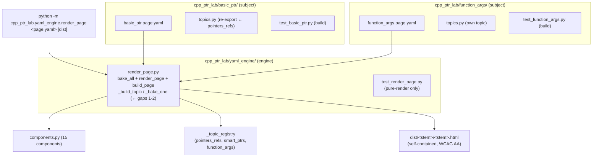

# HANDOFF — 2026-06-30 21h55mEST

**Focus for the next session:** Close the **two known engine gaps** (cases-topics →
`stacked_subcases`, and a configurable `topic` layout), both isolated to `_build_topic` /
`_bake_one` in `cpp_ptr_lab/yaml_engine/render_page.py`. With two subjects now proven, the
**course manifest** (ordered subject nav) is also unblocked. All TDD.

## Read first / references
- **`handoffs/HANDOFF_2026-06-30_18h32mEST.md`** — prior handoff; its "Next steps" 1–2 (engine gaps)
  and 4 (course manifest) are the live backlog. Step 3 (`function_args`) is now DONE.
- **`ed0ba63`** — `function_args` subject: the end-to-end "new subject" proof.
- **`5b37bcb`** — split the YAML engine out of the subject package (uniform structure).
- **JOURNAL.md** entries `2026-06-30 21:15` and `21:40` — this session's two units of work.
- **`cpp_ptr_lab/yaml_engine/render_page.py`** — the subject-agnostic engine (was
  `basic_ptr_yaml/render_page.py`). `_build_topic` (~line 188) + `_bake_one` (~line 73) are where both
  gaps live. **Load-bearing artifact.**
- **`cpp_ptr_lab/function_args/{topics.py, function_args.page.yaml}`** — the new subject; the modelling
  pattern for "many co-varying spots from one dropdown" (single `<<mode>>` full-program placeholder).
- **`cpp_ptr_lab/pointers_refs/topics.py`** — `const_taxonomy` (line 56) is the only `cases`-topic; it
  is what gap 1 must render. `CaseDef` is in `cpp_ptr_lab/code_generator.py`.
- **`COURSE_VIA_TOPICS.md`** — the 4-layer curriculum design (manifest → page specs → topic modules →
  components); §8b is the prior-art filter.

## What changed this session
- **New subject `function_args`** (`ed0ba63`): one topic, `mode` dropdown (by value/pointer/reference)
  → 3 tabs via the existing `topic` builder. Reuses `memory_diagram` with **zero new diagram
  components**: pointer→`type=raw`, reference→`type=ref` (baked g++ confirms `ref_addr == target_addr`),
  value→no `PTRDATA` (honest empty diagram; the output console + byte grid + callout carry the lesson).
  The four co-varying spots (signature/assignment/probe/arg) are driven from **one** control by mapping
  each `mode` option to a **complete program body** in a single `<<mode>>` placeholder — no Cartesian
  blow-up, **zero change to `generate_source`**.
- **Engine/subject split** (`5b37bcb` + uncommitted refinements): `basic_ptr_yaml/` removed →
  `yaml_engine/` (engine + pure-render tests) and `basic_ptr/` (subject: `basic_ptr.page.yaml` +
  re-export `topics.py` + `test_basic_ptr.py`). Every subject folder now has the identical shape
  `{__init__.py, topics.py, <subject>.page.yaml, test_<subject>.py}`. Engine `main()` is now general
  (`python -m cpp_ptr_lab.yaml_engine.render_page <page.yaml> [dist]`); `build_page` writes
  `dist/<stem>/<stem>.html`. Doc path refs updated in `COURSE_VIA_TOPICS.md`.
- **Verification:** `python -m pytest cpp_ptr_lab/` → **344 passed** (was 333; +11 function_args, split
  was behavior-preserving). Both pages rebuild via the new CLI. No `basic_ptr_yaml` refs remain in code.

## Decisions locked
- **One dropdown → many co-varying placeholders = one full-program `<<mode>>` value_map entry**, bodies
  built in Python from one `_SKELETON` via `.replace()`. Chosen over a `generate_source` change or a
  Cartesian multi-dropdown. Applies to any future "N discrete whole-program variants" topic.
- **`memory_diagram` is reused, not extended.** value-pass has no pointer link, so it honestly renders
  `_svg_unknown` ("No diagram available"). Truth over uniformity.
- **Uniform subject-package shape; engine lives in its own `yaml_engine/` package.** A subject defines
  `topics.py` locally only if its topics are new; a reused topic (basic_ptr, owned by the `pointers_refs`
  lab) is **re-exported** (single source of truth, no duplication).
- **Engine gaps 1–2 stay deferred** (not folded into the function_args work) — they are separate,
  independently testable steps.

## Next steps
1. **Gap 1 — wire cases-topics through the engine.** `_bake_one` currently flattens a `cases` topic to
   `source=''`/`ptrdata=None`; keep `v["cases"]` and branch `_build_topic` (or add `topic: { layout:
   subcases }`) to emit the existing `stacked_subcases` component. Prove with `const_taxonomy`. RED tests
   first. ~25 lines.
2. **Gap 2 — configurable `topic` layout** — e.g. `topic: { show: [code, diagram, status, output, bytes] }`
   instead of the one hardcoded recipe in `_build_topic`.
3. **Polish the value-tab diagram** — a small `separate-copy` render or a friendlier "no link" box so it
   reads as intentional, not a gap. (Optional; flagged in the `21:15` JOURNAL entry.)
4. **Course manifest** (`course.manifest.yaml` → ordered subject nav) — now unblocked (≥2 subjects). See
   `COURSE_VIA_TOPICS.md`.
5. **Prior-art research pass** (queued) — run **deep-research** per prior handoff step 7 / `COURSE_VIA_
   TOPICS.md` §8b; produces a topic backlog. C++ Insights is the highest-leverage anchor.

**Blocked/gated — git remote diverged:** local `main` is ahead of AND behind `origin/main`
(non-fast-forward; auto-classifier also blocks direct pushes to `main`). Do NOT force-push. Resolve with
`git fetch` + `git log --left-right main...origin/main` and let the user decide before any pull/rebase.

## Constraints still in force
- **Static, zero-JS, zero-network, Canvas-pasteable** output. g++ is **build-time only** (pages bake real
  compiler output; builders raise early if it's missing).
- **TDD mandatory** (RED before GREEN, `~/.claude/memory/feedback/testing.md`).
- **Additive / surgical diffs;** keep the 344-test suite green.
- **Generated `.md` files need a `YYYY-MM-DD_HHhMMmEST` stamp** (this file complies).
- **Run from the project root** `/Users/erlebach/src/2026/isc5305_f2026/opencode` — the `-m` module and
  relative spec/dist paths resolve against cwd.
- **Audience:** grad students weak in C; gotchas producing real compiler errors are pedagogically wanted.

## Suggested skills
- **test-driven-development** — RED-first for both engine gaps.
- **karpathy-coding / karpathy-guidelines** — surgical edits to `_build_topic` / `_bake_one`.
- **mgrep** — semantic search over `cpp_ptr_lab/` + JOURNAL.md when orienting cold.
- **deep-research** — the queued prior-art survey (step 5).
- **opsx:propose / opsx:apply** — if the course-manifest expansion is formalized as an OpenSpec change.
- **git** — once the remote divergence is resolved (user-gated).

## State-of-the-system diagram — package layout (after this session)

