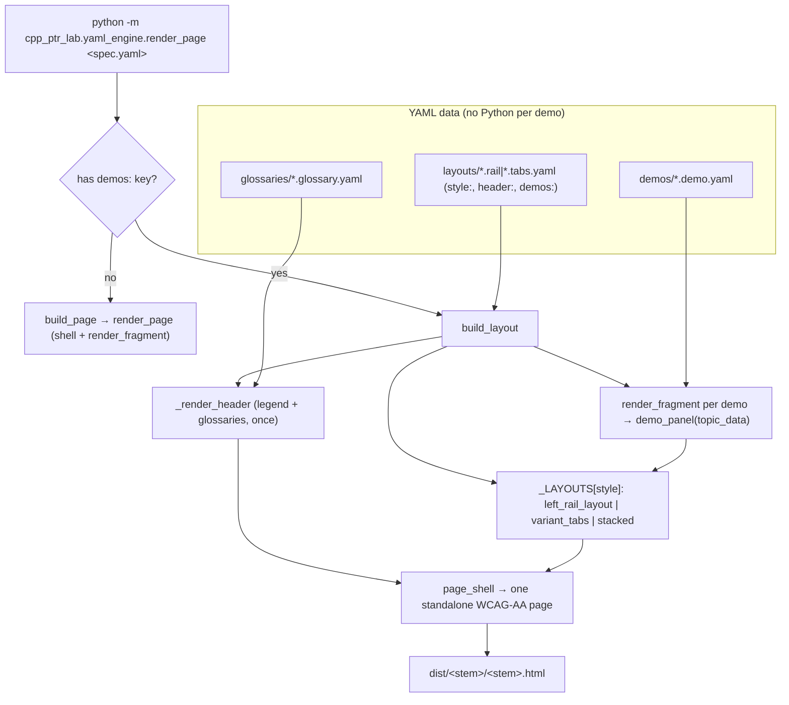

# HANDOFF — 2026-07-01 14h57mEST

**Focus for the next session:** The user will pick an **execution mode** for the demos/layouts
plan — **(1) subagent-driven** (fresh subagent per task, recommended) or **(2) inline** — right after
a `/clear`. Ask which, then execute `docs/superpowers/plans/2026-07-01-demos-and-layouts.md`
task-by-task (TDD, RED→GREEN). **Before starting, resolve the one open design decision below**
(child combinators vs. fully id-namespaced class names).

## Read first / references
- **`docs/superpowers/plans/2026-07-01-demos-and-layouts.md`** — the 10-task TDD implementation
  plan. This is the thing to execute. Complete code + exact commands per task.
- **`docs/superpowers/specs/2026-07-01-demos-and-layouts-design.md`** — the approved design spec
  (vocabulary, architecture, WCAG requirements, North Star). The plan implements this.
- **`~/.claude/memory/feedback/plain-language.md`** and **`feedback/reporting-python-commands.md`**
  — two global behavioral rules captured this session: favor plain language over jargon; always
  enumerate copy/paste-ready python commands when reporting what changed.
- **`cpp_ptr_lab/yaml_engine/render_page.py`** + **`cpp_ptr_lab/components.py`** — the engine +
  component library the plan modifies. **Load-bearing.**
- **`cpp_ptr_lab/pointers_refs/topics.py`** — the 8 TopicTemplates the demos wrap (both gotchas:
  `null_deref` + `dangling_ptr`).

## What changed this session
- **Gap 1 shipped** (`76429cd`, `3c0057e`): cases-topics render through the engine via
  `stacked_subcases`; proven on `const_taxonomy` (2×2, real g++ `read-only` error). Suite 344→350.
- **Combined `pointers_refs.page.yaml` lab page** (`e48e572`, `988d97e`): stacked one-page render of
  7 topics (the long-scroll version — now superseded in intent by the demos/layouts design). 350→357.
- **`README.md`** created + committed (`fb4aa12`).
- **Design spec** written and iterated across 5 commits (last `…` — see `git log docs/superpowers/specs/`):
  demo/glossary/layout separation, WCAG 1.1.1 text-alts as a tested requirement, data-over-code North Star.
- **Implementation plan** written + committed: 10 TDD tasks. **No implementation code written yet.**
- **Verification:** `python -m pytest cpp_ptr_lab/` → **357 passed** (state before plan execution).

## Decisions locked
- **demo = one whole topic** (its type/case tabs stay internal = one nav entry). Finer-grained
  placement is a non-goal.
- **Layout = author-chosen subset of demos + a `header:` rendered once + a nav `style:`**
  (`left_rail` now, `top_tabs` next, `stacked` ≈ current). Author picks everything explicitly —
  **no built-in "family."**
- **Glossary = reusable minimal YAML** `{title, terms:[{term,def}]}`, prose-only (no baked fields),
  0..N per page, kept simple so a **future skill can auto-generate** it.
- **Data over code (North Star):** authoring content adds **YAML, never Python**. Moving C++ source
  Python→YAML is the deferred final step (non-goal here).
- **Phase (a) left-rail first, then phase (b) top-tabs** from the *same* demos — user wants both as
  separate standalone pages to compare, regardless of final choice.

## Open design decision (resolve before/at Task 9)
The user raised the general principle: **scope layouts with `
`s carrying well-chosen ids to
prevent CSS bleed.** That is already the codebase's primary mechanism (every component wraps a
`#{namespaced-id}` div and prefixes its selectors). The residual bleed risk is *cross-nesting*: a
**descendant** selector (`#outer .vt-panel`) reaches a nested component reusing the bare class
`.vt-panel`. Plan **Task 9** fixes this with **child combinators** (`>`). A cleaner alternative the
user is effectively pointing at: **fully id-namespace the class names** (e.g. `.vt-panel-{id}`), so no
class is ever shared across instances and nesting is safe without `>` discipline. **Decide which to
adopt** — child combinators (smaller diff, per the current plan) or class-namespacing (larger but
eliminates the whole class of bug). If the latter, adjust Task 9 (and any component reusing generic
class names) accordingly.

## Next steps
1. **Ask the user: execution mode (1) subagent-driven or (2) inline.** Gated on their choice.
2. Resolve the open design decision above (affects Task 9, possibly Tasks 3–5 class names).
3. Execute the plan RED→GREEN, committing per task. Phase (a) = Tasks 1–8 → left-rail page; phase
   (b) = Tasks 9–10 → top-tabs page. Build + eyeball each page (`open dist/…`).
4. On completion: prepend a JOURNAL.md entry and `/git`.

## Constraints still in force
- **Static, zero-JS, zero-network, Canvas-pasteable** output; g++ is **build-time only** (builders
  raise if it's missing). **WCAG AA**, and **WCAG 1.1.1 text alternatives are an asserted test**.
- **TDD mandatory** (RED before GREEN, `~/.claude/memory/feedback/testing.md`).
- **Run from the project root** `/Users/erlebach/src/2026/isc5305_f2026/opencode`.
- **Additive/surgical diffs**; keep the suite green (357 baseline).
- **Reporting rule:** always enumerate copy/paste-ready `python` commands; **plain language over jargon.**
- **Generated `.md` files** need a `YYYY-MM-DD_HHhMMmEST` stamp (this file complies; spec/plan/README are exempt static docs).

## Suggested skills
- **superpowers:subagent-driven-development** — if the user picks mode (1); fresh subagent per task + review.
- **superpowers:executing-plans** — if the user picks mode (2); batch execution with checkpoints.
- **test-driven-development** — RED-first for every task.
- **mgrep** — semantic search over `cpp_ptr_lab/` when orienting cold.

## State-of-the-system diagram — target architecture (after the plan lands)

