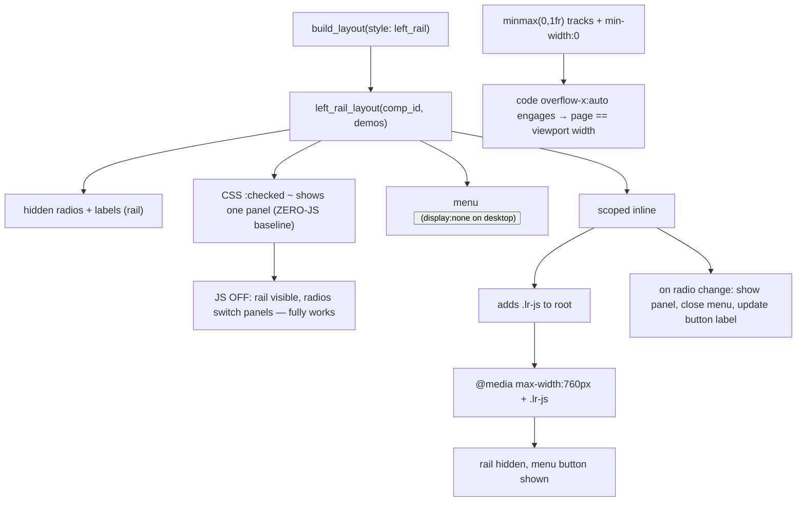

# HANDOFF — 2026-07-01 23h14mEST

**Focus for the next session:** The demos/layouts feature is built and the mobile
rendering is fixed. The remaining decision is **glossary compactness** — the user
prefers **Option D** (move the glossary out of the always-on header into the nav as its
own selectable "Vocabulary" entry, italic to distinguish it), not yet implemented. Also
pending: **integrate the branch** (`feat/demos-and-layouts`, ~14 commits, not merged) via
PR/merge once the user is satisfied.

## Read first / references
- **Prior handoff:** `handoffs/HANDOFF_2026-07-01_14h57mEST.md` (pre-implementation state).
- **Spec / plan (authoritative):** `docs/superpowers/specs/2026-07-01-demos-and-layouts-design.md`,
  `docs/superpowers/plans/2026-07-01-demos-and-layouts.md` (plan reconciled to class-namespacing).
- **Authoring guide (this session):** `cpp_ptr_lab/pointers_refs/YAML_GUIDE.md` — plain-language
  explainer of how demo/glossary/layout YAML fit together (incl. §4d cases-topic worked example).
- **Load-bearing code:** `cpp_ptr_lab/components.py` (`left_rail_layout`, `code_diagram_panel`,
  `glossary`, `demo_panel`), `cpp_ptr_lab/yaml_engine/render_page.py` (`build_layout`, `_render_header`).
- **Content (data-only):** `cpp_ptr_lab/pointers_refs/{demos,glossaries,layouts}/*.yaml`.

## What changed this session
- **Demos & layouts system fully implemented** (13 commits `314169f`..`c741062`, subagent-driven,
  TDD RED→GREEN): `render_fragment` split; `demo_panel`, `glossary`, `left_rail_layout` components;
  `build_layout` + CLI routing; 8 demo YAMLs + glossary + rail (phase a) & tabs (phase b) pages;
  `variant_tabs` id-namespaced (nesting-safe); friendly `ValueError` on unknown `style:`. JOURNAL
  entry `c741062` covers this. Suite 357→381.
- **Mobile fix (this session, UNCOMMITTED — commit pending suite-green):**
  - **Horizontal-overflow bug fixed** (root cause: a `1fr` grid track's `min-width:auto` couldn't
    shrink below the code `<pre>`'s 673px min-content, forcing the whole page to ~700px at any
    viewport). Fix: `minmax(0,1fr)` tracks + `min-width:0` in `code_diagram_panel` and
    `left_rail_layout`, so `overflow-x:auto` engages and long code scrolls in-box. Verified at 375px:
    `document.scrollWidth == 375` (was 719).
  - **Route J mobile menu:** at ≤760px the left rail collapses to a tap-to-open menu button; picking
    a demo shows it and closes the menu + updates the button label. Scoped inline `<script>` gated on
    a JS-added `lr-js` class → **works with JS off** (rail just shows, as before). Verified in
    Playwright (open→pick→close, label update, desktop unchanged).
  - Tests: added `TestMobileOverflow` + `TestLeftRailMobileMenu`; **relaxed 3 committed "no `<script>`"
    assertions** (`test_left_rail_zero_js`→`test_left_rail_no_external_script`, plus both layout
    `test_no_dup_ids_self_contained`) to forbid only *external* script/network — the approved JS
    deviation. `YAML_GUIDE.md` "No JavaScript" line corrected. `.gitignore` += `.playwright-cli/`.

## Decisions locked
- **JS is now permitted** for progressive enhancement (user: not using Canvas). Invariant relaxed from
  "zero-JS" to "**works without JS + no external/network resources**" (inline JS OK). This overrides the
  original zero-JS North Star for interactivity that CSS genuinely can't do (menu auto-close-on-select).
- **CSS scoping = full class-namespacing** (`.vt-panel-{p}`, `.lr-panel-{p}`), not child combinators.
- **Glossary compactness = Option D** (glossary as a nav entry, not header block), italic label to
  distinguish from demos; underline avoided (reads as a hyperlink). NOT YET IMPLEMENTED.

## Next steps
1. **Confirm suite green, then commit the mobile work** (4 modified files + `.gitignore`) — grouped:
   one commit for the overflow+menu component change, one for the guide/test doc bits (or a single
   `feat(components): mobile overflow fix + Route J nav menu`). *(Gated on the full `pytest cpp_ptr_lab/`
   run finishing green — a fast subset already passed; expected ~386.)*
2. **Implement Option D** (glossary → nav entry): decide whether it's a new layout mechanism (glossary
   listed among nav items) or a `demo_panel`-like wrapper; keep it data-authored. TDD.
3. **Integrate the branch** — PR (`gh pr create`) or local merge, user's call. Not yet done.
4. Optional: `references.glossary.yaml`; clean the `100vh/overflow:hidden` base-CSS holdover in
   `html_renderer.py` (harmless, overridden by `page_shell`).

## Constraints still in force
- **Run from project root** `/Users/erlebach/src/2026/isc5305_f2026/opencode`.
- **Self-contained output:** no external `src=`/`https://`; **inline JS now allowed** but must degrade
  gracefully (page works JS-off). **WCAG AA**; WCAG 1.1.1 svg-count == role="img"-count is an asserted test.
- **TDD** RED→GREEN (`feedback/testing.md`); **surgical diffs** (Karpathy); **plain language**; always
  **enumerate copy/paste python commands** when reporting; **present options with an explicit
  recommendation** in plain-text numbered form (this user dismisses the AskUserQuestion widget —
  `feedback/presenting-options.md`).
- g++ is **build-time only**; layout tests are g++-gated. **Playwright `file://` is blocked** — serve
  over `python3 -m http.server` and use `http://localhost:PORT/...`.
- Generated `.md` reports need a `YYYY-MM-DD_HHhMMmEST` stamp; `YAML_GUIDE.md` is exempt (durable doc).

## Suggested skills
- **superpowers:brainstorming** — before implementing Option D, to pin the mechanism (glossary-in-nav).
- **superpowers:test-driven-development** — RED-first for Option D.
- **andrej-karpathy-skills:karpathy-guidelines** — surgical diffs.
- **superpowers:finishing-a-development-branch** — when integrating the branch (PR vs merge).
- **playwright-cli** — for any further mobile/visual verification (remember: serve over HTTP).
- **mgrep** — semantic orientation over `cpp_ptr_lab/`.

## State-of-the-system diagram — left_rail rendering (baseline + JS enhancement)

