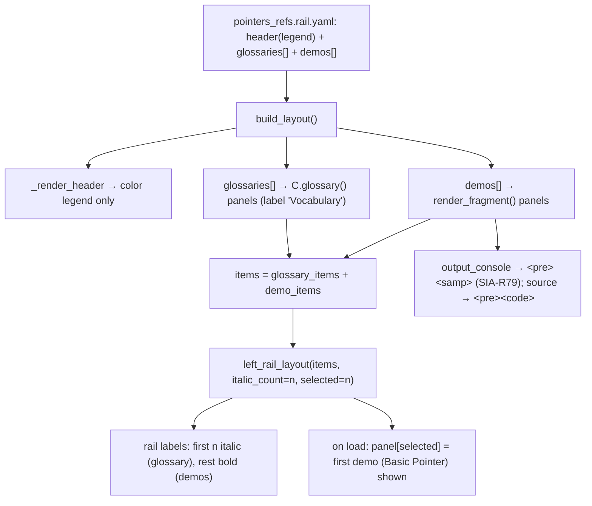

# HANDOFF — 2026-07-02 14h02mEST

**Focus for the next session:** The demos/layouts feature is complete, Option D (glossary as a
rail entry) and the `<samp>` accessibility fix are done and committed. The main remaining task is
to **integrate the `feat/demos-and-layouts` branch** into `main` (PR or merge, user's call). One
explicitly **deferred** item: add `<code class="language-XXX">` (real language) to source blocks.

## Read first / references
- **Prior handoff:** `handoffs/HANDOFF_2026-07-01_23h14mEST.md` (mobile fix + Option D decision).
- **JOURNAL.md** (top 2 entries) — the `<samp>` a11y fix and Option D, with rationale.
- **Spec / plan:** `docs/superpowers/specs/2026-07-01-demos-and-layouts-design.md`,
  `docs/superpowers/plans/2026-07-01-demos-and-layouts.md`.
- **Authoring guide:** `cpp_ptr_lab/pointers_refs/YAML_GUIDE.md`.
- **Load-bearing code:** `cpp_ptr_lab/components.py` (`left_rail_layout` — new `italic_count`/`selected`
  kwargs; `output_console` — now `<pre><samp>`), `cpp_ptr_lab/yaml_engine/render_page.py`
  (`build_layout` — reads `glossaries:`; `_pre` — the deferred language-class site).
- **Content (data-only):** `cpp_ptr_lab/pointers_refs/layouts/pointers_refs.rail.yaml` (glossary moved
  from `header:` to a new `glossaries:` list).
- **New global memory:** `~/.claude/memory/domain/html-accessibility.md` (the bare-`<pre>` / ARIA rule).

## What changed this session
- **Option D — glossary → italic "Vocabulary" rail entry** (not a header block). New `glossaries:`
  top-level layout key; `build_layout` prepends each as a full rail panel; `left_rail_layout` gained
  `italic_count` + `selected` kwargs. **Basic Pointer stays the on-load panel.** Tabs page untouched.
- **Accessibility (SIA-R79)** — `output_console` now emits `<pre><samp>…</samp></pre>` (was a bare
  `<pre>`). Source code already used `<pre><code>`. Rejected `aria-label` on role=generic elements.
- **Verification:** full suite **391 passed** via `python -m pytest cpp_ptr_lab/` (was 386 at session
  start: +5 net). Rail page rebuilt to `dist/pointers_refs.rail/pointers_refs.rail.html`.
- Commit SHAs: see `git log` on `feat/demos-and-layouts` (committed via `/git` this session).

## Decisions locked
- **Glossary nav position:** first in the rail (mirrors old top position), italic, but a **demo** is
  the default-shown panel (`selected = len(glossaries)`) — vocab is reachable, not the landing view.
- **`<samp>` (not `<code>`) for program output** — semantically "sample output"; both clear SIA-R79.
- **No `aria-label` on `<code>`/`<pre>`/`<samp>`** — role=generic, not announced by screen readers;
  distinguish code vs. output with the existing visible "Program output"/"Error output" label.
- **Italic + glossary-in-nav is left_rail-only** for now; the top-tabs page keeps its header glossary.

## Next steps
1. **Integrate the branch** — `feat/demos-and-layouts` (~17 commits, not merged). `gh pr create`
   or local merge into `main`. This is the main open task.
2. **(Deferred, user-approved) language class on source blocks** — add `<code class="language-XXX">`
   with the *real* language. `_pre` is in the subject-agnostic engine, so thread a `language:` field
   from the demo/page YAML rather than hardcoding `cpp`. Not needed for SIA-R79. TDD.
3. **Optional:** `references.glossary.yaml`; sweep the legacy bare `<pre>` in `html_renderer.py:554`
   (old basic_ptr/function_args pages) when those are unified; clean the `100vh/overflow:hidden`
   base-CSS holdover.

## Constraints still in force
- **Run from project root** `/Users/erlebach/src/2026/isc5305_f2026/opencode`.
- **Self-contained output:** no external `src=`/`https://`; **inline JS allowed** but must degrade
  gracefully (page works JS-off). **WCAG AA.** Asserted tests: svg-count == `role="img"`-count;
  **no bare `<pre>`** (every `<pre>` has a `<code>`/`<samp>` child).
- **TDD** RED→GREEN (`feedback/testing.md`); **surgical diffs** (Karpathy); **plain language**;
  always **enumerate copy/paste python commands** when reporting; **present options with an explicit
  recommendation** in plain-text numbered form (user dismisses the AskUserQuestion widget).
- g++ is **build-time only**; layout/rail tests are g++-gated (skip without g++). Full suite ≈ 3 min.
- **Playwright `file://` is blocked** — serve over `python3 -m http.server -d dist PORT` and use
  `http://localhost:PORT/...`.
- Do **not** commit `~/.claude/` files, the untracked `session-*.md` dumps, `prototype/`, the
  `"I created this interface…"` md, or the unrelated `BEST-MODELS-FOR-OPENCODE.md` change (pre-existing,
  not ours).

## Suggested skills
- **superpowers:finishing-a-development-branch** — for the branch integration (PR vs merge).
- **superpowers:test-driven-development** — RED-first for the deferred language-class work.
- **andrej-karpathy-skills:karpathy-guidelines** — surgical diffs.
- **playwright-cli** — visual/mobile verification (serve over HTTP, not `file://`).
- **mgrep** — semantic orientation over `cpp_ptr_lab/`.

## State-of-the-system diagram — left_rail rendering (after Option D)

