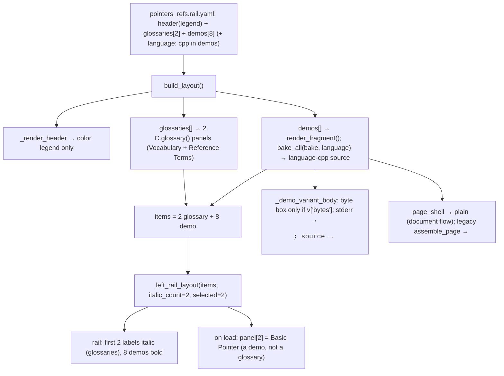

# HANDOFF — 2026-07-02 15h30mEST

**Focus for the next session:** The demos/layouts branch is feature-complete, fully pushed, and PR #1 is
open — the next agent's job is to **review/merge PR #1** (user's call) and, if the user wants to keep
building, start the one remaining North-Star item: **move the C++ source from Python (`topics.py`) into
YAML** (a design task — brainstorm before coding).

## Read first / references
- **Prior handoff:** `handoffs/HANDOFF_2026-07-02_14h02mEST.md` (Option D + `<samp>` a11y; "integrate the
  branch" was that session's next-step — now done).
- **JOURNAL.md** (top 6 entries) — this session's work, latest-first, each with rationale.
- **PR #1:** https://github.com/erlebach/C-interactive-labs/pull/1 (branch `feat/demos-and-layouts` → `main`,
  32 commits; all this session's commits are pushed to it).
- **Spec / plan:** `docs/superpowers/specs/2026-07-01-demos-and-layouts-design.md`,
  `docs/superpowers/plans/2026-07-01-demos-and-layouts.md`.
- **Authoring guide:** `cpp_ptr_lab/pointers_refs/YAML_GUIDE.md`.
- **Load-bearing code touched this session:**
  - `cpp_ptr_lab/yaml_engine/render_page.py` — `_pre`/`_bake_program`/`_bake_one`/`bake_all` now take an
    optional `language`; `build_page`/`build_layout` pass `spec.get("language")`.
  - `cpp_ptr_lab/components.py` — `page_shell` emits plain `<body>`; `_CSS` viewport-lock scoped to
    `body.lab-shell`; `byte_grid` cells 15px; `_demo_variant_body` emits the byte box only `if v["bytes"]`.
  - `cpp_ptr_lab/html_renderer.py` — legacy `assemble_page` body carries `class="lab-shell"`; failed-compile
    stderr wrapped `<pre><samp>`.
- **New data (data-over-code):** `cpp_ptr_lab/pointers_refs/glossaries/references.glossary.yaml` + the
  `language: cpp` field added to 8 demo YAMLs and 3 page YAMLs; second glossary wired in
  `layouts/pointers_refs.rail.yaml`.

## What changed this session
All TDD RED→GREEN, surgical diffs. Suite **391 → 401**. Every item committed + pushed; JOURNAL current.
- **Source language class** (`f1b3bea`, `e0d653b`) — `language:` YAML → `<code class="language-cpp">`;
  classless when omitted (backward compat). Engine stays subject-agnostic; `cpp` lives in data.
- **Item 5 — scoped viewport-lock** (`c75367c`, `e97a2c8`) — moved DPG-era `body{height:100vh;overflow:hidden}`
  into `body.lab-shell`; document pages (`page_shell`) now flow normally; legacy pages opt in via the class.
- **Item 4 — legacy stderr `<samp>`** (`25da376`, `6538753`) — failed-compile stderr was a bare `<pre>`;
  now `<pre><samp>` (SIA-R79). Every page satisfies the no-bare-`<pre>` invariant now.
- **Byte-grid readability** (`0ba5271`, `7dd7184`) — cell text 13px → 15px (user screenshot; verified in
  Playwright, cellW 33→38px).
- **Byte box data-driven** (`a812ec6`, `1186cfc`) — empty byte-grid on no-byte variants (failed compile)
  rendered a degenerate table whose caption wrapped one word/line (user screenshot, Ref: Must Bind). Fix:
  emit the box only `if v["bytes"]` — keys off data, not the compile-status flag; one code path.
- **Item 3 — second glossary** (`07cd1b9`, `8e2db1a`) — added a Reference-Semantics glossary to the rail
  page; **zero engine changes**, pure YAML + one layout line. `italic_count` auto-bumps to 2.
- **Verification:** `python -m pytest cpp_ptr_lab/` → **401 passed** (~3 min, g++-gated). Rail page rebuilt
  to `dist/pointers_refs.rail/pointers_refs.rail.html`.

## Decisions locked
- **`language:` is data, threaded through the engine** — `_pre` never hardcodes `cpp`; the class only
  appears when the YAML declares `language:`. Rules out per-subject engine branches.
- **Viewport-lock scoped, not deleted** — `body.lab-shell` still ships one inert rule in the shared `_CSS`
  (removed fully only when the legacy `html_renderer.py` path is unified). Document pages must never carry it.
- **Byte box keys off `v["bytes"]`, never `failed`/`ok`** — same render path for pass/fail; presence of data
  decides. (User rejected a "show empty state" branch — it added conditionals.)
- **Glossaries are 0..N per page, data-only** — a second glossary is a YAML file + one `glossaries:` line;
  a **demo** (Basic Pointer), not a glossary, is still the on-load panel.
- **Branch integration = PR (not local merge)** — PR #1 stays open for review; iterating on it means commit
  → push on the same branch (updates PR #1 in place). After merge, branch fresh from `main` for new work.

## Next steps
1. **Review & merge PR #1** (user's call). Optional visual check first: `python3 -m http.server -d dist 8000`
   → `http://localhost:8000/pointers_refs.rail/pointers_refs.rail.html`. After merge, delete the branch and
   branch fresh from `main` for any new feature.
2. **North-Star endgame (deferred, larger) — move C++ source Python → YAML.** Source currently lives in
   `cpp_ptr_lab/pointers_refs/topics.py` (`TopicTemplate`); the final data-over-code step makes the C++
   programs pure YAML data. **Brainstorm/design before coding** (superpowers:brainstorming).
3. **Optional small cleanups noted but not done:** `html_renderer.py:576` interpolates `{source}`
   *unescaped* into `<pre><code>` — verify it's escaped upstream when legacy is unified; drop the inert
   `.lab-shell` rule at that same unification.

## Constraints still in force
- **Run from project root** `/Users/erlebach/src/2026/isc5305_f2026/opencode`.
- **TDD RED→GREEN** (`feedback/testing.md`); **surgical diffs** (Karpathy); **plain language**; **present
  options as plain-text numbered lists with an explicit recommendation** (user dismisses the AskUserQuestion
  widget); **one change → one JOURNAL entry** before the next item.
- **Self-contained output:** no external `src=`/`https://`; **inline JS allowed** but must degrade gracefully
  (page works JS-off). **WCAG AA.** Asserted invariants: svg-count == `role="img"`-count; **no bare `<pre>`**
  (every `<pre>` has a `<code>`/`<samp>` child).
- g++ is **build-time only**; layout/rail tests are g++-gated (skip without g++). Full suite ≈ 3 min.
- **Playwright `file://` is blocked** — serve over `python3 -m http.server -d dist PORT`, use `http://localhost`.
  `playwright-cli eval` wants an expression or `ref => fn`; avoid bare arrow fns in the eval string (parsed as
  a function and called without a ref → error). Clean up `*.png` screenshots + `.playwright-cli/` after.
- **Do NOT commit** `~/.claude/` files, the untracked `session-*.md` dumps, `prototype/`, the
  `"I created this interface…"` md, or the pre-existing `BEST-MODELS-FOR-OPENCODE.md` change (not ours).

## Suggested skills
- **superpowers:brainstorming** — before the North-Star source→YAML design (step 2); it's a real design fork.
- **superpowers:test-driven-development** — RED-first for any new engine/data work.
- **andrej-karpathy-skills:karpathy-guidelines** — surgical diffs, data-driven over conditional branches.
- **playwright-cli** — visual/mobile verification (serve over HTTP, not `file://`).
- **mgrep** — semantic orientation over `cpp_ptr_lab/` and JOURNAL.md.

## State-of-the-system diagram — left_rail rendering (after this session)

