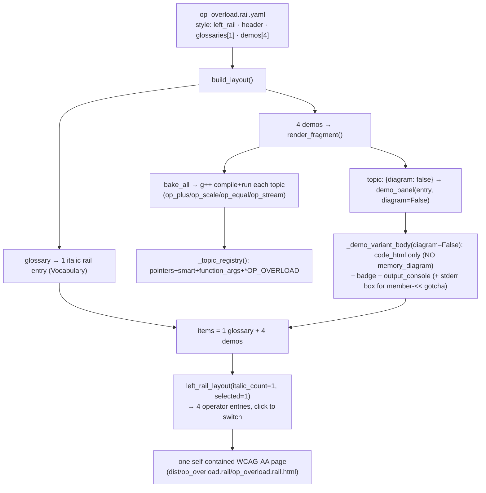

# HANDOFF — 2026-07-03 00h30mEST

**Focus for the next session:** **Increase reusability** of the demo/layout machinery (the user's stated
next thrust), and get ready for a workflow shift where **the user drafts YAML and the agent polishes**.
Concretely: factor the `demo_panel` / `nav_shell` seam, promote the generic topic loader to a shared
module, and suppress the lone single-variant "default" tab. Also uncommitted `op_overload` work is ready
to commit (see below).

## Read first / references
- **Prior handoff:** `handoffs/HANDOFF_2026-07-02_15h30mEST.md` (source→YAML migration; now merged to main).
- **JOURNAL.md** top 2 entries — this session's op_overload demo + the pointers_refs source→YAML migration.
- **Authoring guides (the polish-my-YAML workflow depends on these):** `usage/USAGE.md` (end-to-end
  new-subject recipe), `cpp_ptr_lab/pointers_refs/YAML_GUIDE.md` (per-file format reference).
- **Architecture + the reusability seam already sketched:** `COURSE_VIA_TOPICS.md` (§7 "topic layout is a
  fixed recipe" is the seam; the `diagram: false` flag is the first cut at it).
- **Reference implementation to imitate:** `cpp_ptr_lab/pointers_refs/` (topics/demos/glossaries/layouts).
- **New subject added this session:** `cpp_ptr_lab/op_overload/` (mirrors pointers_refs).
- **Load-bearing engine files touched:** `cpp_ptr_lab/components.py` (`_demo_variant_body`, `demo_panel`
  now take `diagram: bool = True`); `cpp_ptr_lab/yaml_engine/render_page.py` (`_build_topic` reads
  `diagram`; `_topic_registry` imports op_overload).

## What changed this session
Two units of work. The first is **already on main and pushed**; the second is **uncommitted** (this
handoff + `/git` will land it).

1. **pointers_refs source → YAML** (merged PR-less, fast-forwarded to `main`, pushed `origin/main` at
   `c329393`). 8 topics' C++ moved from `topics.py` literals to `topics/*.topic.yaml` + a generic
   `topics_loader.load_topics(topics_dir)`; `topics.py` is a shim; an equivalence-guard test proves
   losslessness. Docs updated: `COURSE_VIA_TOPICS.md`, new `usage/USAGE.md`. (Full detail: JOURNAL
   2026-07-02 19:30 + `docs/superpowers/{specs,plans}/2026-07-02-source-to-yaml*`.)
2. **op_overload demo + optional-diagram flag** (uncommitted, on `main` working tree):
   - Engine: `topic: { diagram: false }` suppresses the memory diagram (default on → pointer pages
     byte-unchanged). RED→GREEN in `test_render_page.py::TestOptionalDiagram`.
   - Subject `cpp_ptr_lab/op_overload/`: 4 topics, 4 demos, 1 glossary, 1 `left_rail` layout → **4 rail
     entries** (`operator+`, `operator*`, `operator==`, `operator<<` where `<<` pairs the correct
     non-member version + the member-`<<` compile-error gotcha). `op_overload/test_op_overload.py` (7 tests).
   - Wiring: `op_overload/topics.py` shim reuses `pointers_refs/topics_loader.load_topics`; one line added
     to `_topic_registry`.
   - Verified: full suite **421 passed** (was 412); page builds self-contained, no diagram, real g++
     output, gotcha compile error.

## Decisions locked
- **Optional diagram is an explicit flag, default on** — NOT auto-skip on `has_ptrdata: false` (that would
  change existing compile-failure pointer panels and risk the svg-count invariant). op_overload demos set
  `diagram: false`.
- **Nav granularity = "demo = one nav entry"** — the user chose **4 separate left-rail entries** (option A)
  over stacked cases; each operator is its own demo. The `<<` entry keeps correct+mistake as two stacked
  cases (the pointer-gotcha pattern).
- **op_overload reuses the pointers_refs loader by cross-import** for now — promoting `topics_loader.py` to
  a shared module is deliberately deferred to the reusability pass.
- **Workflow direction (new):** the user will author YAML drafts; the agent polishes. Optimize for
  human-draftable YAML + zero-Python content. (Saved to project MEMORY.md.)

## Next steps
1. **Commit the op_overload work** — grouped: (a) engine diagram flag (`components.py`, `render_page.py`
   `_build_topic`, `test_render_page.py`), (b) op_overload subject + registry wiring
   (`cpp_ptr_lab/op_overload/`, the `_topic_registry` line), (c) JOURNAL + handoff. **Currently on `main`;
   branch first** (`feat/op-overload`) per the branch-first rule, unless the user says otherwise.
2. **Increase reusability (the main thrust)** — factor the seam described in `COURSE_VIA_TOPICS.md §7`:
   a `demo_panel(topic_data)` unit + a `nav_shell(items, style=…)` unit so the same content pours into
   left_rail / top_tabs / stacked by choice. Design first (brainstorm) — it's a real seam decision.
3. **Suppress the lone "default" tab** for single-variant topics (~small `variant_tabs`/`demo_panel` tweak;
   fold into the reusability pass). Cosmetic only; visible on op_overload's single-program operators.
4. **Promote `topics_loader.py`** to a shared module (e.g. `cpp_ptr_lab/topic_yaml.py`) so every subject's
   `topics.py` shim calls `load_topics(Path(__file__).parent / "topics")` without cross-subject imports.
5. **More subjects, mostly YAML** — remaining course topics: initializers, stack frames (needs the one new
   frame diagram), classes, templates, STL. See `COURSE_VIA_TOPICS.md` per-topic cost table.

## Constraints still in force
- **Run from project root** `/Users/erlebach/src/2026/isc5305_f2026/opencode`.
- **TDD RED→GREEN**; **surgical diffs**; **plain language**; **options as plain-text numbered lists with an
  explicit recommendation** (user dismisses the AskUserQuestion widget).
- **Self-contained output:** no external `src=`/`href="http"`; inline JS ok but must degrade; **WCAG AA**;
  svg-count == `role="img"`-count; no bare `<pre>`.
- **g++ is build-time only**; layout/integration tests are g++-gated (skip without g++). Full suite ≈ 3.5 min.
- **Do NOT commit** `~/.claude/` files, untracked `session-*.md`, `prototype/`, the `"I created this…"` md,
  or the pre-existing `BEST-MODELS-FOR-OPENCODE.md` change (not ours). Use explicit `git add <paths>`.
- **`rm` is interactive** in this shell (prompts) — use `rm -f` for scripted deletes.
- **Playwright `file://` blocked** — serve via `python3 -m http.server -d dist PORT`.

## Suggested skills
- **superpowers:brainstorming** — before the reusability seam (step 2); it's a genuine design fork.
- **superpowers:test-driven-development** — RED-first for the seam refactor and the "default"-tab fix.
- **andrej-karpathy-skills:karpathy-guidelines** — surgical diffs; data-driven over conditional branches.
- **superpowers:finishing-a-development-branch** — to integrate `feat/op-overload` after committing.
- **playwright-cli** — visual verification of new pages (serve over HTTP).
- **mgrep** — semantic orientation over `cpp_ptr_lab/`, `COURSE_VIA_TOPICS.md`, `usage/USAGE.md`.

## State-of-the-system diagram — op_overload build + the diagram flag

