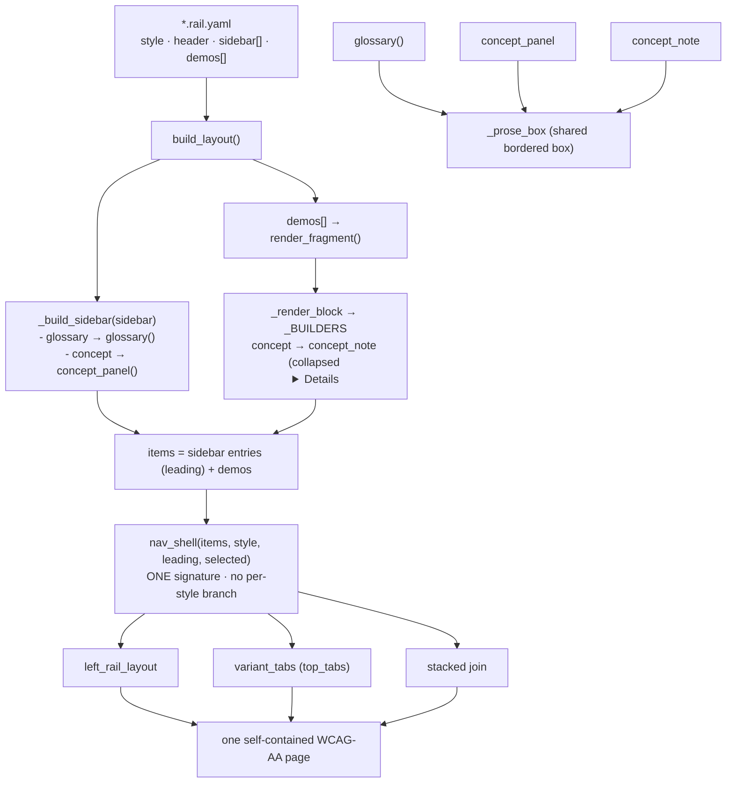

# HANDOFF — 2026-07-03 14h55mEST

**Focus for the next session:** **PR #2 is open** (https://github.com/erlebach/C-interactive-labs/pull/2, `feat/op-overload` → `main`, 21 commits). Decide how to land it (squash vs merge-commit), then pick up the next thrust: more subjects authored mostly as YAML (the standing direction), and the one deferred cleanup below.

## Read first / references
- **Prior handoff:** `handoffs/HANDOFF_2026-07-03_00h30mEST.md` (the op_overload session that opened this branch; its "next steps" 1–4 are now all done).
- **JOURNAL.md** top entry (`2026-07-03 14:30 — Reusability seam …`) — the full narrative of what shipped; do not restate it.
- **Spec + plan:** `docs/superpowers/specs/2026-07-03-reusability-seam-design.md`, `docs/superpowers/plans/2026-07-03-reusability-seam.md` (the design + the executed TDD plan).
- **PR #2** — the whole branch (op_overload + two quick-wins + the reusability seam). Its body has the summary + test plan.
- **Load-bearing code:** `cpp_ptr_lab/components.py` (`nav_shell`, `_prose_box`, `concept_note`, `concept_panel`); `cpp_ptr_lab/yaml_engine/render_page.py` (`_build_concept`, `_build_sidebar`, `build_layout`, `_BUILDERS`).
- **Authoring guides (kept current):** `usage/USAGE.md`, `cpp_ptr_lab/pointers_refs/YAML_GUIDE.md`, `COURSE_VIA_TOPICS.md`.

## What changed this session
- **Two quick-wins landed** — suppressed the lone single-variant "default" tab (`9552360`); promoted the topic loader to shared `cpp_ptr_lab/topic_yaml.py` so subjects stop cross-importing (`c3d4b66`).
- **Reusability seam** (brainstorm → approved spec → TDD plan → 8 subagent-driven tasks, each spec- + quality-reviewed, then a final holistic review): `nav_shell` uniform nav; shared `_prose_box`; Example Concept as a collapsed `
` (`concept` block, 12 demos migrated, `callout_note` kept); Demonstration Concept + unified `sidebar:` list. Commits `9f6b5c6`..`b064fd2`.
- **Plain-language docstrings** for the six new seam functions, each argument described, type hints kept (`75299e8`).
- **PR #2 opened** against `main`.
- **Verification:** full suite **438 passed, 0 failed, 0 skipped** (g++ present); two byte-identical guards (nav_shell left_rail == old `left_rail_layout`; glossary unchanged) prove the refactor is lossless.

## Decisions locked
- **Scope was "make the seam honest," not build new nav styles** — `top_tabs`/`stacked` are now correct through `nav_shell` but no page uses them yet (one is a one-line `style:` change later).
- **`callout_note` is backward-compatible, not deprecated** — still in `_DISPATCH`; only the *default* per-example Concept changed to the `concept` block.
- **Leading rail entries unified into one keyworded `sidebar:` list** (`- glossary:` / `- concept:`) — chosen over keeping two separate keys, for consistency (see `~/.claude/memory/feedback/consistency.md`).
- **`_prose_box` factors `glossary` + both Concept renderers only** — legacy `callout_note` deliberately left out (forcing it in added complexity for no gain; user confirmed).
- **Vocabulary locked:** demonstration / example / gotcha / concept (see project `MEMORY.md`).

## Next steps
1. **Land PR #2** — merge to `main` (squash or merge-commit, user's call); then delete the local branch and start the next work from a fresh branch off `main`.
2. **Deferred cleanup (minor, from final review):** glossary-from-`source:` loading is duplicated between `_render_header` and `_build_sidebar` in `render_page.py` — extract a tiny shared helper. Non-blocking; do it on the next branch, TDD.
3. **More subjects, mostly YAML** (the standing direction — user drafts YAML, agent polishes): remaining course topics per `COURSE_VIA_TOPICS.md` — initializers, stack frames (needs one new frame diagram), classes, templates, STL. `function_args`/`smart_ptrs` still hold topics in Python and can be migrated to the shared `topic_yaml.py` loader.
4. **Optional:** author a `top_tabs` or `stacked` page to exercise the now-uniform `nav_shell` end-to-end (currently only `left_rail` is used in practice).

## Constraints still in force
- **Run from project root** `/Users/erlebach/src/2026/isc5305_f2026/opencode`.
- **New behavioral rules saved this session (apply them):**
  - `~/.claude/memory/feedback/markdown-formatting.md` — **no hard-wrapped Markdown paragraphs** (one paragraph/list-item = one line; Marked2 breaks on mid-paragraph wraps).
  - `~/.claude/memory/feedback/code-documentation.md` — document every file/module/class/function in **plain, non-technical language**, describe **each argument**, use **type hints**.
  - `~/.claude/memory/feedback/consistency.md` — prefer consistency, but not at the expense of complexity; when they conflict, **ask**.
- **TDD RED→GREEN; surgical diffs; options as plain-text numbered lists with an explicit recommendation** (user dismisses the AskUserQuestion widget).
- **Self-contained output:** no external `src=`/`href="http"`; inline JS ok but must degrade; **WCAG AA**; svg-count == `role="img"`-count; no bare `<pre>`.
- **g++ is build-time only**; layout/integration tests are g++-gated (skip without g++). Full suite ≈ 3.5 min.
- **Do NOT commit** scratch/untracked: `session-*.md`, `prototype/`, `a.md`, `harness.md`, `TODO_NEXT.md`, the `"I created this…"` md, the pre-existing `BEST-MODELS-FOR-OPENCODE.md` change (not ours), or the stray `cpp_ptr_lab/pointers_refs/JOURNAL.md`. Use explicit `git add <paths>`.
- **`rm` is interactive** — use `rm -f`. **Playwright `file://` blocked** — serve via `python3 -m http.server -d dist PORT`.

## Suggested skills
- **superpowers:finishing-a-development-branch** — to land PR #2 (merge) and clean up the branch.
- **superpowers:brainstorming** — before authoring the next subject (a real content/design decision), and before the `top_tabs`/`stacked` page if attempted.
- **superpowers:test-driven-development** — RED-first for the deferred DRY cleanup and any new subject.
- **superpowers:subagent-driven-development** — the per-task implement→spec-review→quality-review loop worked well this session; reuse it for the next multi-task plan.
- **andrej-karpathy-skills:karpathy-guidelines** — surgical diffs, data-over-code.
- **mgrep** — semantic orientation over `cpp_ptr_lab/`, the specs, and `COURSE_VIA_TOPICS.md`.

## State-of-the-system diagram — the reusability seam (after)

Context can be cleared after `/git` completes.
