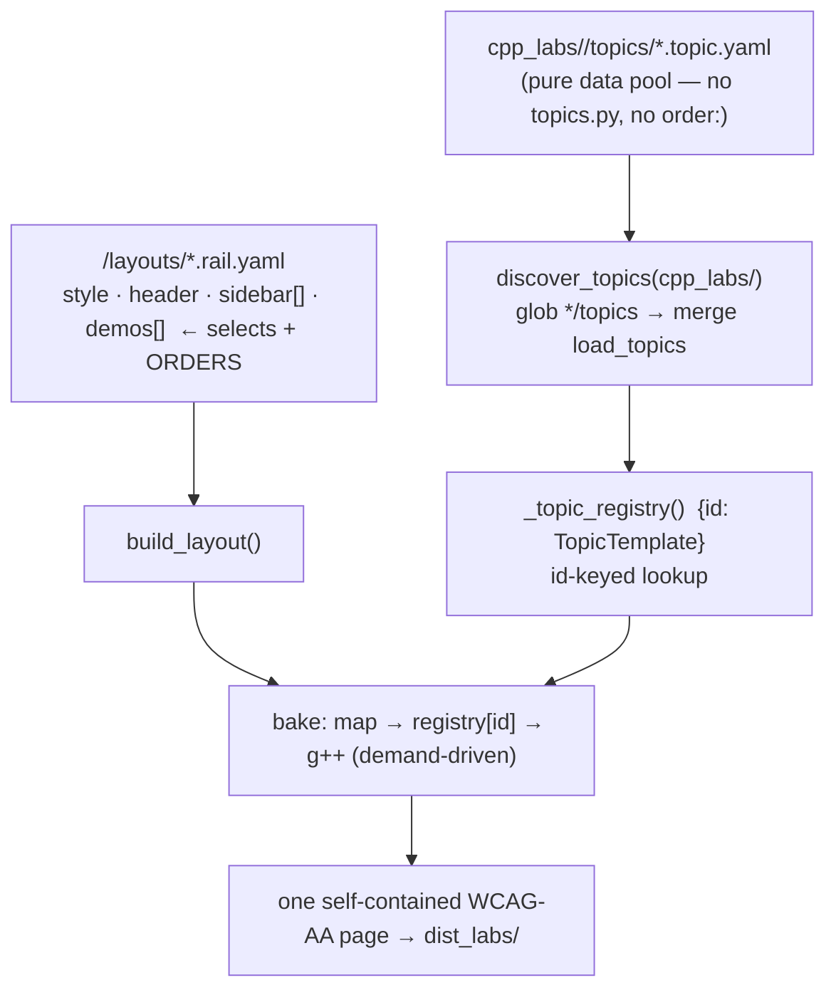

# HANDOFF — 2026-07-03 20h59mEST

**Focus for the next session:** The `cpp_labs/` migration + folder-consistency arc is complete and green; a PR is open. Land it, then close the two remaining structural gaps (`function_args`/`smart_ptrs` still lack `demos/ glossaries/ layouts/`; `smart_ptrs` has no layout so it renders nowhere) — or start a new subject, mostly as YAML.

## Read first / references
- **Prior handoff:** `handoffs/HANDOFF_2026-07-03_14h55mEST.md` (the reusability-seam session that preceded this one; its PR #2 is merged into `main`).
- **The 7 session commits** (`15da2d0..9f502d0` on branch `fix/glossary-loader-dry`) — the whole arc; the PR body summarises them. Do not restate.
- **Load-bearing code:** `cpp_labs/topic_yaml.py` (`load_topics`, new `discover_topics`); `cpp_labs/yaml_engine/render_page.py` (`_topic_registry` now auto-discovers).
- **Authoring guide (moved this session):** `usage/YAML_GUIDE.md` (was `cpp_labs/pointers_refs/YAML_GUIDE.md`); `usage/USAGE.md`.
- **Canonical subject shape:** `cpp_labs/op_overload/` and `cpp_labs/pointers_refs/` are the two North-Star exemplars — copy their layout.

## What changed this session
- **`refactor(engine) 15da2d0`** — extracted `_glossary_from_source` shared helper (deduped `_render_header`/`_build_sidebar`). *(This was on the old `cpp_ptr_lab/` tree, carried into `cpp_labs/` by the next commit.)*
- **`chore 9948195`** — copied the live lab `cpp_ptr_lab/ → cpp_labs/` (subject name is no longer pointer-specific); output now targets `dist_labs/`. Included only files reachable from HTML construction (traced via the build entry point); dropped the DPG-era modules. `cpp_ptr_lab/` left untouched as a frozen copy.
- **`refactor 5367609`** — migrated the last two Python-defined subjects (`function_args`, `smart_ptrs`) to `topics/*.topic.yaml`.
- **`refactor 1a9d039`** — **the North-Star registry**: `_topic_registry` now auto-discovers `cpp_labs/*/topics` (new `discover_topics`); deleted all five `topics.py` shims; retired the `order:` key (render order lives in the layout's `demos:` list, not the loader).
- **`test e419027`** — de-duplicated the loader tests (shared serializer), removing subject-test-imports-another-subject's-test coupling.
- **`test 0809966`** — moved each subject's tests into a `tests/` subfolder (`__init__.py` per dir so same-named `test_topics_loader.py` files stay distinct packages).
- **`refactor 9f502d0`** — folder consistency: `pointers_refs.page.yaml → layouts/`, `YAML_GUIDE.md → usage/`, and **retired the migration scaffolding** (deleted `topics_snapshot.json` ×3, the `test_yaml_matches_legacy` guards, and the now-dead `cpp_labs/tests/topic_equiv.py`).
- **Verification:** full `pytest cpp_labs/` = **428 passed** (g++ present); all five pages rebuild into `dist_labs/` self-contained. The registry resolves the same 21 topic ids as before the refactor (asserted against a captured baseline).

## Decisions locked
- **Only `pointers_refs` + `op_overload` are the North-Star subjects.** `basic_ptr` and `function_args` are the first two demos and "no longer conform" — do **not** use them to judge the design; leave them building but don't invest in restructuring them unless asked.
- **`topics/` is a pure pool; the layout selects + orders.** Auto-discovery may collect unused topics — harmless, because baking is demand-driven from the page's `bake:` map, so an unreferenced topic is never compiled or rendered. Hence `order:` was redundant and is gone.
- **Migration snapshots retired** — they only proved the Python→YAML migration was lossless (already recorded in git history); keeping them would nag on every intentional YAML edit and fight the author-YAML workflow. `op_overload` (born-YAML) never had one.
- **A new subject is now pure data** — a folder with a `topics/` dir of YAML + a layout; zero Python, no registry edit.

## Next steps
1. **Land the PR** (`fix/glossary-loader-dry` → `main`) — squash or merge, user's call; then delete the branch and start fresh from `main`. **Consider renaming the branch** first (e.g. `feat/cpp-labs`) — the name is stale; offered repeatedly, not yet actioned.
2. **Close the structural gaps** (known-legacy, scoped out this session): `function_args`/`smart_ptrs` lack `demos/ glossaries/ layouts/`; `function_args` still has its own `function_args.page.yaml` at root (same stray `pointers_refs` had). Decide per-subject: bring to canonical shape, or retire the legacy subjects.
3. **Give `smart_ptrs` a layout** so it's a real demonstration (it's baked/tested but renders nowhere today).
4. **More subjects, mostly YAML** (standing direction — user drafts YAML, agent polishes): remaining `COURSE_VIA_TOPICS.md` topics (initializers, stack frames, classes, templates, STL).
5. **Optional:** exercise the now-uniform `nav_shell` with a `top_tabs`/`stacked` page (only `left_rail` is used in practice; `pointers_refs/layouts/pointers_refs.tabs.yaml` exists but is unused).

## Constraints still in force
- **Run from project root** `/Users/erlebach/src/2026/isc5305_f2026/opencode`. Build: `python -m cpp_labs.yaml_engine.render_page <layout.yaml> dist_labs`.
- **`cpp_ptr_lab/` is the frozen old copy — do not edit it.** All work is in `cpp_labs/`.
- **Behavioral rules (this arc):** no hard-wrapped Markdown paragraphs (one paragraph/list-item = one line); document every file/module/function in plain language with each argument described and type hints; prefer consistency but not at the cost of complexity — when they conflict, **ask**.
- **TDD RED→GREEN; surgical diffs; options as plain-text numbered lists with an explicit recommendation** (user dismisses the AskUserQuestion widget).
- **Self-contained output:** no external `src=`/`href="http"`; WCAG AA; svg-count == `role="img"`-count; no bare `<pre>`.
- **g++ is build-time only**; layout/integration tests are g++-gated. Full `cpp_labs/` suite ≈ 3.2 min.
- **`dist_labs/` is gitignored.** `rm` is interactive — use `rm -f`. Playwright `file://` blocked — serve via `python3 -m http.server -d dist_labs PORT`.
- **Do NOT commit** scratch/untracked at repo root: `session-*.md`, `prototype/`, `a.md`, `harness.md`, `TODO_NEXT.md`, the pre-existing `BEST-MODELS-FOR-OPENCODE.md` modification (not ours). Use explicit `git add <paths>`.

## Suggested skills
- **superpowers:finishing-a-development-branch** — to land the PR and clean up the branch.
- **superpowers:test-driven-development** — RED-first for any new subject/layout.
- **superpowers:brainstorming** — before authoring a new subject or giving `smart_ptrs` a layout (a real content/design decision).
- **andrej-karpathy-skills:karpathy-guidelines** — surgical diffs, data-over-code.
- **mgrep** — semantic orientation over `cpp_labs/`, `usage/`, and `COURSE_VIA_TOPICS.md`.

## State-of-the-system diagram — the auto-discovery registry (after)

Context can be cleared after `/git` completes and the PR is open.
