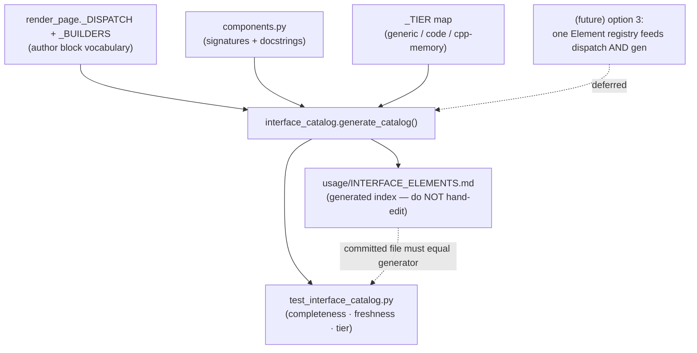

# HANDOFF — 2026-07-04 12h15mEST

**Focus for the next session:** Build & verify the new `cpp_labs/class_structure/` subject (authored as YAML this session, not yet compiled) — `python -m cpp_labs.yaml_engine.render_page cpp_labs/class_structure/layouts/class_structure.rail.yaml dist_labs` — then give it a `tests/` folder mirroring `op_overload/tests/`.

## Read first / references
- **`handoffs/HANDOFF_2026-07-03_20h59mEST.md`** — prior session (cpp_labs migration + auto-discovery). Its "a new subject is pure data" claim is what this session exercised.
- **`usage/INTERFACE_ELEMENTS_DESIGN.md`** — the plain-language design doc written this session: what the catalog is, the three tiers, and how option (1) relates to the future single-registry option (3). Read this before touching the catalog.
- **`usage/INTERFACE_ELEMENTS.md`** — the generated catalog (do NOT hand-edit; regenerate).
- **`cpp_labs/yaml_engine/interface_catalog.py`** — the generator (introspects `render_page._DISPATCH`/`_BUILDERS` + `components.py` signatures/docstrings). `_TIER` map lives here.
- **Canonical subject shape to copy:** `cpp_labs/op_overload/` (born-YAML, `diagram: false`, has `tests/`).
- **Project memory note (2026-07-04)** in `…/opencode/memory/MEMORY.md` — records option (3) and its staged migration path.

## What changed this session
- **New subject `cpp_labs/class_structure/`** — 5 topics (`cls_ctor`, `cls_copy_ctor`, `cls_copy_assign`, `cls_move_ops`, `cls_init_list`) + 5 demos + 1 glossary + 1 `left_rail` layout. Pure YAML, structured identically to `op_overload`. **Not yet built or tested** (user asked for YAML only). One shared instrumented `Buffer`/`Point` class per example; `diagram: false`, `has_ptrdata: false`; real g++ output is baked at build time (none hand-written).
- **Interface-element catalog (option 1) — built TDD.** New `cpp_labs/yaml_engine/interface_catalog.py` generates `usage/INTERFACE_ELEMENTS.md`; new `cpp_labs/yaml_engine/test_interface_catalog.py` is the drift guard (completeness + freshness + every keyword has a reuse tier). Added a **reuse-tier** column: `generic` (12 + both sidebar), `code` (3), `cpp-memory` (4).
- **Design doc** `usage/INTERFACE_ELEMENTS_DESIGN.md` (plain language + the (1)-vs-(3) comparison table).
- **Feedback memory** `~/.claude/memory/feedback/spelling.md` — correct the user's misspellings (don't propagate); American spelling (`catalog`, not `catalogue`). Then corrected all 25 `catalogue`→`catalog` in this session's files.
- **Verification:** `pytest cpp_labs/yaml_engine` = **61 passed**; catalog tests **4 passed** (incl. freshness: committed MD == generator output). `class_structure` has **no** test run yet.

## Decisions locked
- **`class_structure` scope** — "move operator" = move ctor **and** move assignment in one example (`cls_move_ops`); "initializer operator" = `std::initializer_list<int>` constructor (`cls_init_list`). Topic ids prefixed `cls_` to stay unique in the merged auto-discovery registry.
- **The catalog is generated, never hand-edited.** Add an element → edit code → `python -m cpp_labs.yaml_engine.interface_catalog`. The drift-guard test fails if the committed file is stale or a keyword/tier is missing. This is option (1) — an *index*; it does not change dispatch.
- **Option (3) is deferred, kept in notes.** Collapse the four scattered dispatch tables into one in-code `Element` registry the engine reads directly; the catalog would then generate from that one list. Do it only once the four-way scatter causes friction. Staged migration recorded in project memory.
- **Reuse tiers** classify portability to another course: `generic` = any domain (an LLM course pilfers these), `code` = any compiled language, `cpp-memory` = pointer/memory visuals only. `code_line_link` tagged **`code`** by *mechanism* though its data is pointer-specific — a one-word `_TIER` change flips it to `cpp-memory` if you prefer data-based tagging.
- **Spelling:** American, and correct the user's spelling rather than mirroring it.

## Next steps
1. **Build `class_structure`** (gated on g++): `python -m cpp_labs.yaml_engine.render_page cpp_labs/class_structure/layouts/class_structure.rail.yaml dist_labs`. Confirms all 5 topics compile+run and the page is self-contained. Serve to eyeball: `python3 -m http.server -d dist_labs 8000`.
2. **Add `cpp_labs/class_structure/tests/`** mirroring `op_overload/tests/` (`__init__.py` + build/self-containment assertions; g++-gated). TDD RED-first.
3. *Optional:* add a compile-error **gotcha** example to `class_structure` (e.g. a move-only type that fails to copy) — the subject currently has examples but no gotcha.
4. *Optional (offered, not done):* cross-link `usage/INTERFACE_ELEMENTS.md` from `usage/USAGE.md` and `usage/YAML_GUIDE.md` so authors discover it.
5. *When it bites:* option (3) single-registry refactor (characterization tests first — prove byte-identical output for all pages).

## Constraints still in force
- **Run from project root** `/Users/erlebach/src/2026/isc5305_f2026/opencode`. Build: `python -m cpp_labs.yaml_engine.render_page <layout.yaml> dist_labs`.
- **`cpp_ptr_lab/` is the frozen old copy — do not edit it.** All work is in `cpp_labs/`.
- **TDD RED→GREEN; surgical diffs.** Document every file/module/function in plain language, each argument described, with type hints. No hard-wrapped Markdown paragraphs (one paragraph/list-item = one line). Present options as plain-text numbered lists with an explicit recommendation (user dismisses the AskUserQuestion widget).
- **Self-contained output:** no external `src=`/`href="http"`; WCAG AA; svg-count == `role="img"`-count; no bare `<pre>`. g++ is build-time only; full `cpp_labs/` suite ≈ 3.2 min.
- **`dist_labs/` is gitignored;** `rm` is interactive (use `rm -f`); Playwright `file://` blocked (serve via `http.server`).
- **Do NOT commit** repo-root scratch: `session-*.md`, `prototype/`, `a.md`, `harness.md`, `TODO_NEXT.md`, `run.x`, the `BEST-MODELS-*.md` modification, the stray 2 MB `usage/typescript`, `cpp_ptr_lab/pointers_refs/JOURNAL.md`. Use explicit `git add <paths>`.
- **Spelling:** American; correct the user's misspellings or ask.

## Suggested skills
- **superpowers:test-driven-development** — RED-first for the `class_structure` tests and any catalog change.
- **andrej-karpathy-skills:karpathy-guidelines** — surgical diffs, data-over-code.
- **superpowers:verification-before-completion** — run the build + suite before claiming class_structure works.
- **mgrep** — semantic orientation over `cpp_labs/`, `usage/`, `components.py`.

## State-of-the-system diagram — the new catalog-generation pipeline

Context can be cleared after `/git` completes.
