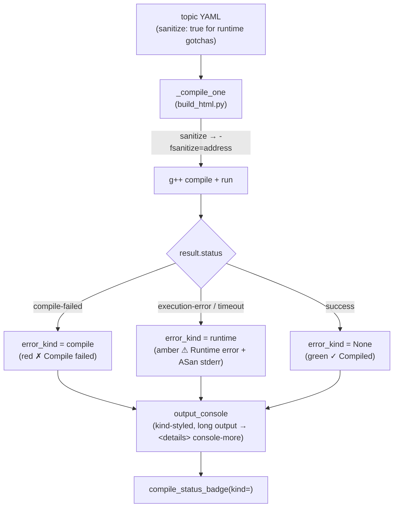

# HANDOFF — 2026-07-04 15h17mEST

**Focus for the next session:** Do the two deferred follow-ups (in this order): **(1)** make `dangling_ptr` actually crash by setting `ASAN_OPTIONS=detect_stack_use_after_return=1` in the run environment (run-env plumbing in `compiler_runner.py`, separate from the compile-flag fix already landed), and **(2)** give `cls_copy_assign` a gotcha — the missing self-assignment guard — which needs (1)'s run-env work (or an ASan-detectable formulation) to render as a runtime error rather than silently exiting 0.

## Read first / references
- **`handoffs/HANDOFF_2026-07-04_12h15mEST.md`** — prior session (class_structure authored as YAML; interface catalog). This session built on it.
- **Project memory** `…/opencode/memory/MEMORY.md` — three load-bearing notes added/updated this session: **LOCKED: all C++ examples use `class`, not `struct`**; **RESOLVED: sanitize flag wired to ASan**; **Gotchas are content, not a component / compile-vs-runtime rendering**.
- **`cpp_labs/build_html.py`** `_compile_one` — where `error_kind` classification (B) and the `-fsanitize=address` wiring live; this is where follow-up (1)'s run-env change goes (the *run* step, not the compile step).
- **`cpp_labs/components.py`** — `compile_status_badge(…, kind=)`, `output_console(…, kind=, _OUTPUT_LINE_LIMIT)`, `_demo_variant_body` (B + C).
- **`cpp_labs/compiler_runner.py`** — `compile_and_run(source, extra_flags=…)` and the run step (`_run_cancellable`); follow-up (1) must pass `env=` / `ASAN_OPTIONS` to the run subprocess.
- **Gotcha exemplars (approach B, Correct/Mistake pairs):** `cpp_labs/op_overload/topics/op_stream.topic.yaml` (compile-error pair) and `cpp_labs/class_structure/topics/cls_copy_ctor.topic.yaml` (runtime double-free pair, `sanitize: true`).

## What changed this session (not yet committed — `/git` runs after this)
- **Engine B** — `build_html._compile_one` classifies `error_kind` `None|"compile"|"runtime"`: a program that compiles but crashes/times out is now `failed=True error_kind="runtime"` (was a false green "✓ Compiled"). Rendered as amber **⚠ Runtime error** vs red **✗ Compile failed**. `render_page._bake_program` threads `error_kind`; `_demo_variant_body` passes it to badge + console.
- **Engine C** — `output_console` folds output beyond `_OUTPUT_LINE_LIMIT=12` lines into a native `
` caret disclosure (tames template/STL/ASan walls). CSS in `components.py` + `html_renderer.py`.
- **Sanitize wiring (was a DEAD flag)** — `_compile_one` now passes `extra_flags=["-fsanitize=address","-g"]` when `topic.sanitize`. Fixed `null_deref` (now shows real "AddressSanitizer: SEGV…"). TDD `TestSanitizeWiring` in `cpp_labs/tests/test_build_html.py`.
- **Concept toggle** — button-like chip + rotating caret (`components.py concept_note` + CSS). Cleared a `<pre>`-related ADA flag as a side effect.
- **`struct`→`class` migration + `friend`** — `op_overload` `Vec2` and `class_structure` `Point`/`Buffer` are now `class` (private `x_`/`n_`/`data_`); non-member operators (`operator<<`, non-member `operator*`) are `friend`s; `op_stream`/`op_scale` explanations teach the friend rule.
- **Gotchas (approach B):** `op_overload` — member `operator<<` + non-commutative `2.0*a` (both compile errors); `class_structure` — shallow-copy **double-free** (`cls_copy_ctor`) + **use-after-move** (`cls_move_ops`), both `sanitize: true`, rendering ⚠ Runtime error with full ASan reports.
- **New tests** — `cpp_labs/class_structure/tests/` (7 tests) created this session; `op_overload` tests extended to 10; component/build tests extended for B/C/sanitize.
- **Verification:** full `cpp_labs` suite **455 passed** (`python -m pytest cpp_labs -q`, 3:48). Per-subject: `op_overload` 10/10, `class_structure` 7/7.

## Decisions locked
- **All examples use `class`, never `struct`** (encapsulation/safety). `friend` is the chosen idiom (over accessors) for any non-member operator that reads private data. See memory note.
- **Gotchas = content, not a component** — a gotcha is a topic whose program fails, filed `group`/paired as a Correct/Mistake sub-case (approach B), rendered through the shared path.
- **Runtime gotchas use `sanitize: true`** so ASan gives a precise diagnostic; **compile-error gotchas need no sanitize** (already render red).
- **`cls_copy_assign` left correct-only for now** — self-assignment use-after-free does NOT reliably crash without the run-env work; deferred to follow-up (2).

## Next steps
1. **(follow-up 1) `dangling_ptr` run-env fix** — pass `ASAN_OPTIONS=detect_stack_use_after_return=1` (and likely `abort_on_error=1`) to the *run* subprocess in `compiler_runner.py`. Verify: rebuild `pointers_refs.rail`, confirm `dangling_ptr` flips from green "✓ Compiled" to ⚠ Runtime error with a "stack-use-after-return" ASan report. TDD first.
2. **(follow-up 2) `cls_copy_assign` gotcha** — add the missing-self-assignment-guard Correct/Mistake pair (main does `a = a`), `sanitize: true`; gated on (1)'s ASan run-env so the use-after-free is caught. Add a `test_copy_assign_gotcha_*` mirroring the other two.
3. *Then:* rebuild all rail pages and eyeball via `python3 -m http.server -d dist_labs 8000`.

## Constraints still in force
- **Run from project root** `/Users/erlebach/src/2026/isc5305_f2026/opencode`. Build a page: `python -m cpp_labs.yaml_engine.render_page <layout.yaml> dist_labs`. Layout path pattern: `<subject>/layouts/<subject>.rail.yaml` (folder stem must match).
- **TDD RED→GREEN, surgical diffs.** Plain-language docstrings, each arg typed. No hard-wrapped Markdown paragraphs. American spelling; correct the user's misspellings.
- **`cpp_ptr_lab/` is the frozen old copy — do not edit.** All work in `cpp_labs/`.
- **Self-contained output:** no external `src=`/`href="http"`; WCAG AA; g++ is build-time only; ASan on `sanitize` topics adds run time. Full `cpp_labs/` suite ≈ 3.8 min.
- **`dist_labs/` gitignored;** `rm -f` (rm is interactive); serve via `http.server` (Playwright `file://` blocked).
- **Do NOT commit** repo-root scratch: `session-*.md`, `prototype/`, `a.md`, `a.cpp`, `harness.md`, `TODO_NEXT.md`, `run.x`, the `BEST-MODELS-*.md` modification, `usage/typescript`, `"I created this interface…md"`. Use explicit `git add <paths>`.
- **Interface catalog is generated** — changing a `components.py` signature the catalog introspects requires `python -m cpp_labs.yaml_engine.interface_catalog` or `test_interface_catalog` freshness fails. **Never** put a literal `
` in a CSS comment (leaks into `<style>`, trips `.count("<details")` tests).

## Suggested skills
- **superpowers:test-driven-development** — RED-first for both follow-ups.
- **superpowers:verification-before-completion** — rebuild + run the suite before claiming the gotchas render.
- **andrej-karpathy-skills:karpathy-guidelines** — surgical diffs, data-over-code.
- **mgrep** — semantic orientation over `cpp_labs/`, `compiler_runner.py`.

## State-of-the-system diagram — failure rendering pipeline (after this session)

Context can be cleared after `/git` completes.
