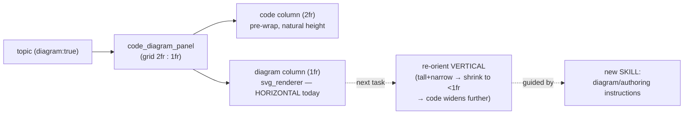

# HANDOFF — 2026-07-04 16h56mEST

**Focus for the next session:** **Brainstorm first** (superpowers:brainstorming) the reconstruction of the SVG memory diagrams from **horizontal** (`viewBox="0 0 500 160"`, boxes left-to-right) to **vertical** (boxes flow top-to-bottom, tall + narrow) so the diagram column can shrink and the code column widen further on diagram pages — **and** create a reusable **skill** capturing the diagram-authoring/reconstruction instructions. Do not write code until the brainstorm settles scope (what "vertical" means for each ptr type, and what the skill should cover).

## Read first / references
- **`handoffs/HANDOFF_2026-07-04_15h17mEST.md`** — prior handoff (B/C failure-rendering, ASan wiring, struct→class, gotchas). Its deferred items 1 & 2 are STILL open (see Next steps).
- **Project memory** `…/opencode/memory/MEMORY.md` — load-bearing notes added this session: **FUTURE: re-orient SVG diagrams vertically** (the next task), **LOCKED example code style** (comments-above + break long `<<`), **Concept fills right column (option 3)**.
- **`cpp_labs/html_renderer.py` `svg_renderer` + `_draw_*`** — the horizontal box/arrow coordinate layout to re-orient. Emits `role="img"` + `<title>`/`<desc>`; WCAG 1.1.1 must be preserved (svg-count == role=img-count is a tested invariant).
- **`cpp_labs/components.py` `code_diagram_panel`** — now `2fr:1fr` grid (code : diagram); when the SVG goes vertical/narrow the ratio may widen further.
- **Skill-authoring:** `superpowers:writing-skills` + `skill-creator:skill-creator` — for building the new skill.

## What changed this session (uncommitted at handoff time; `/git` runs next)
- **Layout space fixes (CSS):** `.demo-wrap` max-width **70rem→100rem** (was jamming content into a narrow centered column); code `<pre>` now `white-space: pre-wrap; overflow-wrap: anywhere` (**no horizontal scroll — full code always visible**); `code_concept_panel` grid **50/50→2fr:1fr**; `code_diagram_panel` grid **50/50→2fr:1fr** and its fixed `max-height: 28rem` cap **removed**; `stacked_subcases` fixed `max-height: 32rem` cap **removed** (both caps were boxing code into small scroll-regions floating in white).
- **Code-style pass — all 9 op_overload + class_structure topics reformatted:** comments moved to their own line **above** the code (no trailing comments); long `std::cout`/`return os` chains **broken at `<<`**, continuations aligned under the first `<<`. Output verified **byte-identical** (subject tests assert exact stdout strings).
- **`build_labs.sh`** (new, repo root) — one command rebuilds every page in `dist_labs/`; auto-discovers `cpp_labs/*/layouts/*.yaml` + `cpp_labs/*/*.page.yaml`; now **echoes the exact `python …` command** per spec; `./build_labs.sh <filter>` builds a subset.
- **Tests updated** for the removed caps (`test_components.py`: `stacked_subcases`, `code_diagram_panel`); regenerated `usage/INTERFACE_ELEMENTS.md`.
- **Verification:** full `cpp_labs` suite **458 passed** (before the final cdp tweak); post-tweak `test_components.py` + `test_render_page.py` **255 passed**. Rebuilt all 7 pages clean.

## Decisions locked
- **Example code style (LOCKED):** comments above (never trailing); break long `<<` chains at `<<`, aligned; multiple `<<` per line OK (NOT strictly one-per-line — supersedes the earlier reading). See memory.
- **Column ratios:** code gets **2fr**, the right column (concept OR diagram) **1fr**. The right/concept panel is intentionally 1/3.
- **`.demo-wrap` at 100rem** (not full-bleed) — fills a laptop, caps ultra-wide monitors.
- **Vertical SVG is the chosen fix** for widening code on diagram pages (rather than only shrinking the horizontal diagram) — but scope/appearance is a brainstorm, not yet decided.

## Next steps
1. **Brainstorm** (superpowers:brainstorming) the vertical-SVG reconstruction: box/arrow layout per ptr type (raw/null/dangling/ref/const), target aspect ratio, and how `code_diagram_panel`'s ratio should change once the diagram is narrow. **Then** decide the skill's scope (diagram-only, or the whole lab-authoring workflow).
2. **Create the skill** (superpowers:writing-skills / skill-creator) once scope is set.
3. **Implement** the vertical `svg_renderer`/`_draw_*` (TDD; keep `role="img"`+`title`/`desc`, svg==role=img invariant), then widen `code_diagram_panel` ratio.
4. **Still-deferred gotcha follow-ups (from prior handoff):** (a) `dangling_ptr` needs `ASAN_OPTIONS=detect_stack_use_after_return=1` at RUN time (run-env plumbing in `compiler_runner.py`) to crash instead of exiting 0/green; (b) `cls_copy_assign` self-assignment gotcha, gated on (a).

## Constraints still in force
- **Run from project root** `/Users/erlebach/src/2026/isc5305_f2026/opencode`. Rebuild all pages: **`./build_labs.sh`** (or `./build_labs.sh <filter>`). Serve: `python3 -m http.server -d dist_labs 8000` (Playwright `file://` blocked).
- **TDD RED→GREEN, surgical diffs.** Plain-language docstrings, each arg typed. Comments-above + break-long-`<<` in all example code. American spelling; correct the user's misspellings.
- **`cpp_ptr_lab/` is frozen — do not edit.** All work in `cpp_labs/`.
- **Self-contained output:** no external `src`/`href="http"`; WCAG AA; svg-count == `role="img"`-count; g++ build-time only; ASan on `sanitize` topics. Full suite ≈ 3.4 min; `dist_labs/` gitignored; `rm -f`.
- **Interface catalog is generated** — changing a `components.py` signature the catalog introspects requires `python -m cpp_labs.yaml_engine.interface_catalog` or `test_interface_catalog` freshness fails. Never put a literal `
` in a CSS comment.
- **Do NOT commit** repo-root scratch: `session-*.md`, `prototype/`, `a.md`, `a.cpp`, `harness.md`, `TODO_NEXT.md`, `run.x`, the `BEST-MODELS-*.md` mod, `usage/typescript`, `"I created…md"`, `cpp_ptr_lab/pointers_refs/JOURNAL.md`.

## Suggested skills
- **superpowers:brainstorming** — REQUIRED first, before any diagram code or skill authoring.
- **superpowers:writing-skills** / **skill-creator:skill-creator** — to build the new diagram/authoring skill.
- **superpowers:test-driven-development** — RED-first for the vertical `svg_renderer`.
- **andrej-karpathy-skills:karpathy-guidelines** — surgical diffs, data-over-code.

## State-of-the-system diagram — the diagram-page layout (after this session)

Context can be cleared after `/git` completes.
