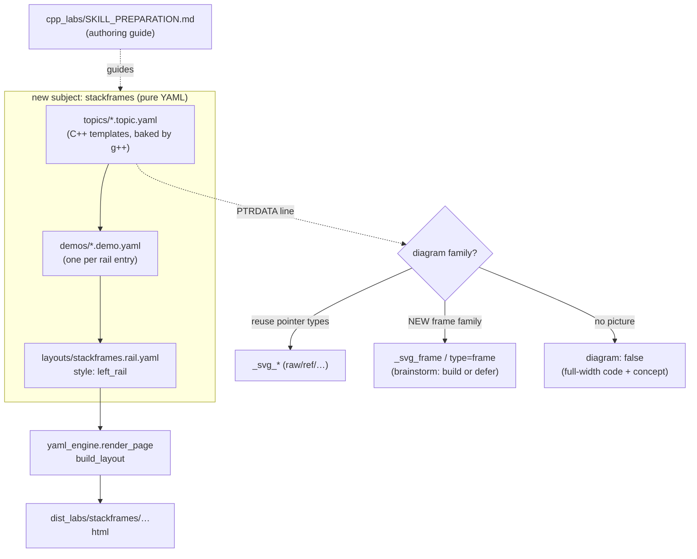

# HANDOFF — 2026-07-04 22h49mEST

**Focus for the next session:** Build a **`stackframes`** demonstration as a **new subject** using the **`left_rail`** layout (like `pointers_refs`). **Brainstorm first** (superpowers:brainstorming): decide the example set AND whether stackframes needs a **new stack-frame diagram family** (a `_frame_svg` layout helper + a new `PTRDATA type=frame`) or should start **`diagram: false`** (code + output + concept, no picture). Do not author until scope is settled — stack frames are a *different diagram family* than the pointer graphs the engine draws today.

## Read first / references
- **`cpp_labs/SKILL_PREPARATION.md`** — the authoritative demonstration-authoring guide written this session. §12.B is the **new-subject checklist**; §8 is page/layout wiring (`left_rail` vs flat); §5 is the PTRDATA convention and the note that a new diagram family adds a thin layout helper, **not** a new skill; §1/§3/§4 cover topic anatomy / controls / sub-cases.
- **`cpp_labs/pointers_refs/layouts/pointers_refs.rail.yaml`** + **`cpp_labs/pointers_refs/demos/*.demo.yaml`** — the canonical `left_rail` exemplar to copy (sidebar glossary + one demo file per rail entry).
- **`docs/superpowers/specs/2026-07-04-vertical-memory-diagrams-design.md`** — the vertical-SVG design; its Roadmap names the 3-level skill hierarchy (leaf **diagram** skill → **demonstration** skill → **course** skill). `SKILL_PREPARATION.md` is the demonstration-skill precursor.
- **`cpp_labs/html_renderer.py`** `_stack_svg` + the six `_svg_*` — the current (pointer-only) diagram family a stack-frame diagram would sit beside.
- **Prior handoff** `handoffs/HANDOFF_2026-07-04_16h56mEST.md` — the vertical-diagram brainstorm that kicked off this session.

## What changed this session (all merged to `main`, nothing pushed to remote)
- **Vertical memory diagrams** — merge `c27444b` (branch work `f72ba66`→`9a26ad9`). Re-oriented all SVG memory diagrams horizontal→vertical via one `_stack_svg(sources, target)` helper encoding the **source-count rule** (≤2 converge, ≥3 stack) with native `<marker>` arrowheads; box text 14px matching the code panel; `code_diagram_panel` widened to **3fr:1fr**; `hover_link_diagram` refactored to reuse `_stack_svg`; **empty right cell (not the `type=? — no diagram` placeholder) for ptrdata-less variants, keeping the code-column width constant across variants**. See `docs/superpowers/plans/2026-07-04-vertical-memory-diagrams.md`.
- **`cpp_labs/SKILL_PREPARATION.md`** — new authoring guide (commit `04c129e`).
- **Four new `function_args` examples** — merge `221607f` (commit `e2387fb`): `fa_const_ref` (read-only alias + compile-error gotcha), `fa_swap` (works vs silent no-op), `fa_out_param` (pointer output params), `fa_copy_cost` (value vs const&, copy-counter). First real use of `SKILL_PREPARATION.md`.
- **Verification:** full `cpp_labs` suite **476 passed**; all 7 pages rebuilt.

## Decisions locked
- **Diagram orientation:** vertical stacked; source-count rule (≤2 converge / ≥3 stack) lives in `_stack_svg`, not per-type. Arrows use `<marker orient="auto-start-reverse">`.
- **Layout stability (feedback rule `~/.claude/memory/feedback/lab-layout-stability.md`):** ptrdata-less variant → **empty right cell, never a placeholder box, never a code-width change**. The per-*topic* `diagram: false` (drops the column, full-width code) is the separate, legitimate mechanism for whole subjects with no memory model.
- **`function_args`:** all four proposed examples authored; page kept **stacked** (user chose not to convert to a rail).
- **`stackframes`:** will use the **`left_rail`** layout (user directive). Example set + diagram approach still to brainstorm.
- **Authoring workflow:** author from `SKILL_PREPARATION.md`; user drafts intent, agent authors/polishes; verify each C++ program compiles with deterministic output *before* baking test assertions.

## Next steps
1. **Brainstorm `stackframes`** (superpowers:brainstorming): which examples (e.g. call/return, locals per frame, recursion depth, pass-by-value copy on the stack, a dangling-reference-to-local gotcha), and **the diagram question** — new `type=frame` family (`_frame_svg` in `html_renderer.py` + parse + a page path) vs start `diagram: false`. This is a design fork; settle before code.
2. **Author the subject** (pure YAML per §12.B): `cpp_labs/stackframes/{topics,demos,layouts,glossaries,tests}/`; a `left_rail` `layouts/stackframes.rail.yaml`. TDD; exact-stdout assertions.
3. If a frame diagram is chosen: TDD a new `_svg_frame`/`type=frame` beside the six existing renderers (keep `role="img"`+`title`/`desc`; svg==role=img invariant).
4. **Still-deferred gotcha follow-ups** (from earlier handoffs, not addressed this session): (a) `dangling_ptr` needs `ASAN_OPTIONS=detect_stack_use_after_return=1` at *run* time (run-env plumbing in `compiler_runner.py`); (b) `cls_copy_assign` self-assignment gotcha, gated on (a). Note: this is the same stack-use-after-return machinery a stackframes dangling-local gotcha would need — consider doing them together.
5. *Optional:* push `main` / open PRs — the remote has **none** of this session's work (or the prior sessions'); `main` is many commits ahead of `origin/main`.

## Constraints still in force
- **Run from project root** `/Users/erlebach/src/2026/isc5305_f2026/opencode`. Rebuild: **`./build_labs.sh`** (or `./build_labs.sh <subject>`). Serve: `python3 -m http.server -d dist_labs 8000` (a server may still be running on :8000; `file://` is blocked for Playwright). Full suite ≈ 3.5–3.7 min (compiles C++).
- **TDD RED→GREEN, surgical diffs.** Verify each C++ program compiles + prints deterministic output before writing exact-stdout test assertions.
- **Locked C++ style:** `class` not `struct` (non-member operators `friend`); comments on their own line **above** code (never trailing); long `<<` chains broken at `<<`, aligned. Tests assert **byte-identical** stdout. American spelling.
- **New subject = pure YAML** (`discover_topics` auto-registers `cpp_labs/*/topics`); no engine code needed unless adding a diagram family.
- **Self-contained output:** no external `src`/`href="http"`; WCAG AA; **svg-count == `role="img"`-count** (tested); g++ build-time only; ASan on `sanitize: true` topics. `dist_labs/` is **gitignored** — never commit built HTML.
- **Interface catalog is generated** — changing a `components.py` signature the catalog introspects requires `python -m cpp_labs.yaml_engine.interface_catalog` or `test_interface_catalog` fails. The catalog also tracks docstrings (a docstring change alone can stale it).
- **Subagent hazard seen this session:** a fix-subagent committed a regression from a contaminated working tree (`e3e0062`, reverted the vertical refactor). It was caught by the spec reviewer's failing viewBox test and corrected (`7c5e9ea`). When delegating fixes, verify the resulting diff is *only* the intended change.
- **Do NOT commit** repo-root scratch: `session-*.md`, `prototype/`, `a.md`, `a.cpp`, `harness.md`, `TODO_NEXT.md`, `run.x`, the `BEST-MODELS-*.md` mod, `usage/typescript`, `"I created…md"`, `cpp_ptr_lab/pointers_refs/JOURNAL.md`.

## Suggested skills
- **superpowers:brainstorming** — REQUIRED first (stackframes example set + diagram-family fork).
- **superpowers:writing-plans** → **superpowers:subagent-driven-development** — once scope is set (with the subagent-diff-verification caveat above).
- **superpowers:test-driven-development** — RED-first for topics and any new `_svg_frame`.
- **andrej-karpathy-skills:karpathy-guidelines** — surgical diffs, data-over-code.

## State-of-the-system diagram — where `stackframes` will plug in

Context can be cleared after `/git` completes.
